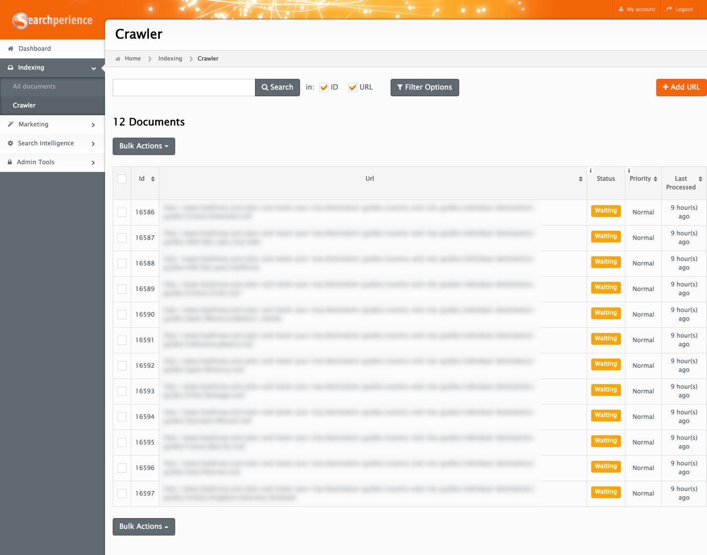
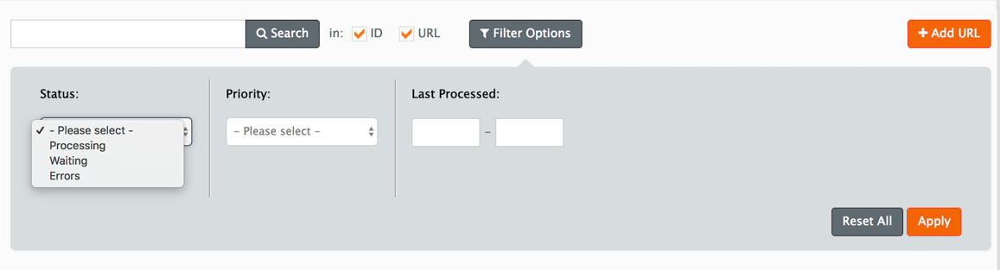
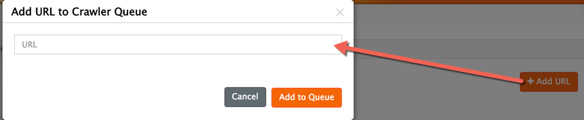
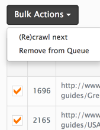

# Crawler

In this module all web pages that get crawled using our HTTP-crawler[^http_crawler] are shown. A web page listed in the table below might be in the Searchperience Frontend available already from a previous crawling. In the case the column `Last Processing` is empty the web page is new to Searchperience and not yet available for searching using the Searchperience Frontend.

!!! note
    All web pages are scheduled for re-crawling on a regular base automatically.

## Search & Filters

Allows to search through the URL queue[^url_queue] to check if for example a missing web page is already scheduled or was rejected and marked as `Error`.
In rare cases the URL queue[^url_queue] is filled with a huge number of URLs, in this case you can use the filters to filter through the possible returned URL queue[^url_queue] items.

## The columns

### Available Columns

| Name               | Value    | Description                                                                                                                                                                                                |
|--------------------|:---------|:-----------------------------------------------------------------------------------------------------------------------------------------------------------------------------------------------------------|
| Id                 | Integer  | The internally used identifier.                                                                                                                                                                            |
| Process start time | DateTime | DateTime when the processing started.                                                                                                                                                                      |
| Priority           | String   | The priority `Immediate` defines that the document should be taken next for crawling. Usually only relevant in rare cases when the queue is filled. All other items have the regular priority of `Normal`. |
| Status             | String   | Current status of the document in the crawler queue.                                                                                                                                                       |
| URL                | String   | URL of the document.                                                                                                                                                                                       |

### Different Queue Item Status

| Name       | Description                                                                         |
|------------|:------------------------------------------------------------------------------------|
| Error      | This happens when a web page cannot be crawled due to a HTTP-Error returned.        |
| Processing | The URL queue[^url_queue] item gets currently crawled.                              |
| Waiting    | The URL is scheduled for crawling and is waiting for a free crawler to get crawled. |

## Add URL

Adds a new or missing web page to the crawler URL queue[^url_queue][^add_to_crawler_queue]. The URL gets added with the priority `Immediate` to the queue and will be visible in the table listing.

## Actions

To apply one of the two available actions on one ore more queue items, just click the check box in the first column.

* `ReCrawl Selected` forces the priority for the selected queue items the priority `Immediate`.
* `Remove from Queue` removes the selected URL queue items from the queue and prevents the web page(s) from getting crawled.

[^http_crawler]: Responsible to download web pages and store them in Searchperience.
[^url_queue]: List of web pages that get downloaded using our Searchperience HTTP-Crawler.
[^add_to_crawler_queue]: Only preconfigured domains and URL patterns are allowed for crawling.
