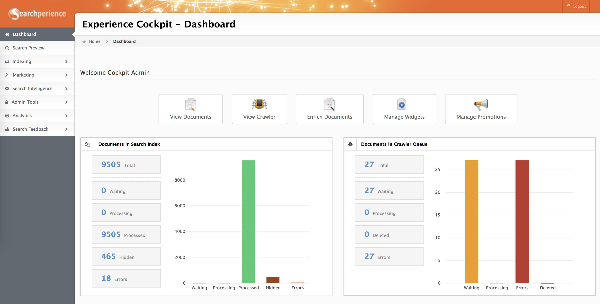
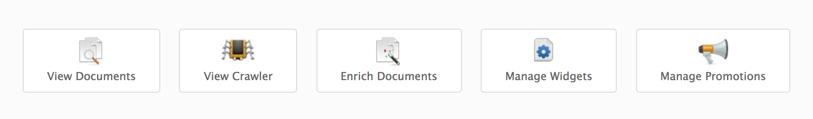
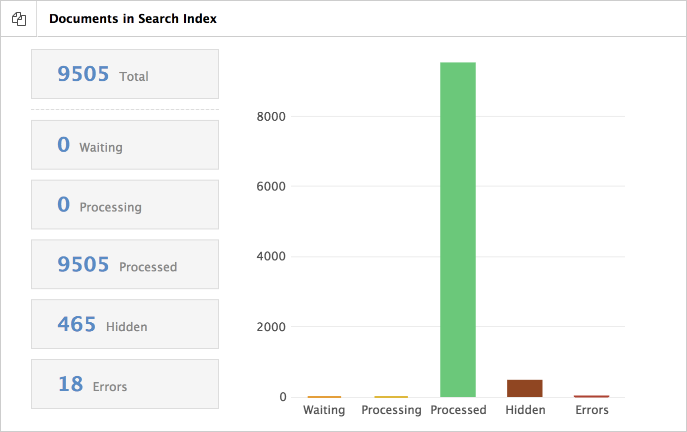
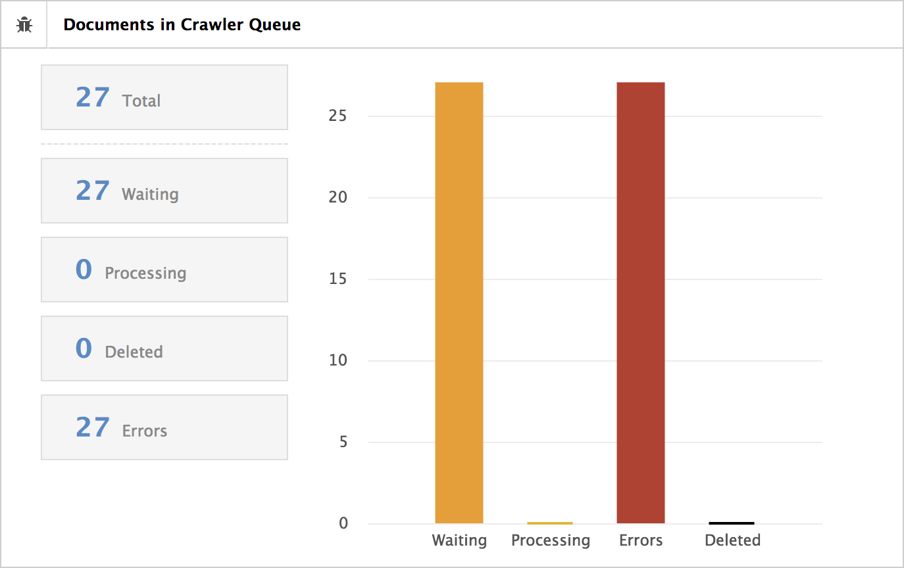
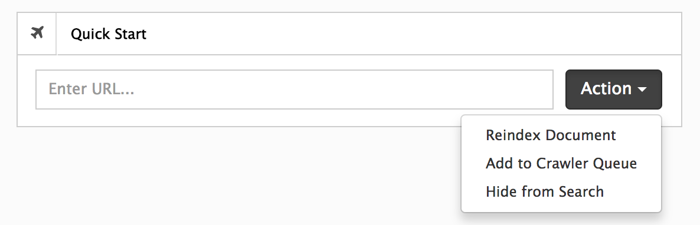

# Dashboard

After successfully logging into Cockpit you will be presented with the dashboard.

The Dashboard offers quick access to any available modules (depending on your user privileges) and to the state of [document](../glossary.md#document) indexing and crawling [^crawling].

## Direct Module Access

This section gives you direct access to the most important modules inside Searchperience Cockpit.

## Document Processing Overview

The graph offers an overview of the overall processing state of [all available documents](documents.md) inside Searchperience.

## Crawler Url Queue Overview

The graph gives an overview about `web pages` scheduled for [crawling](crawler.md).

## Quick Start

The `Quick Start` tool box gives you three options that you can perform by adding a URL of a `web page`.

| Action               | Description                                                                    |
|----------------------|:-------------------------------------------------------------------------------|
| ReIndex Document     | Schedules a `web page` for re crawling.                                        |
| Add to Crawler Queue | Adds a new (missing) web page to the crawler url queue[^add_to_crawler_queue]. |
| Hide From Search     | Hides a `web page` from Searchperience Frontend (not in search available).     |

[^crawling]: The crawler URL queue, that is responsible to fetch e.g. HTML pages from the internet.
[^add_to_crawler_queue]: Only pre configured domains and url patterns are allowed for crawling.