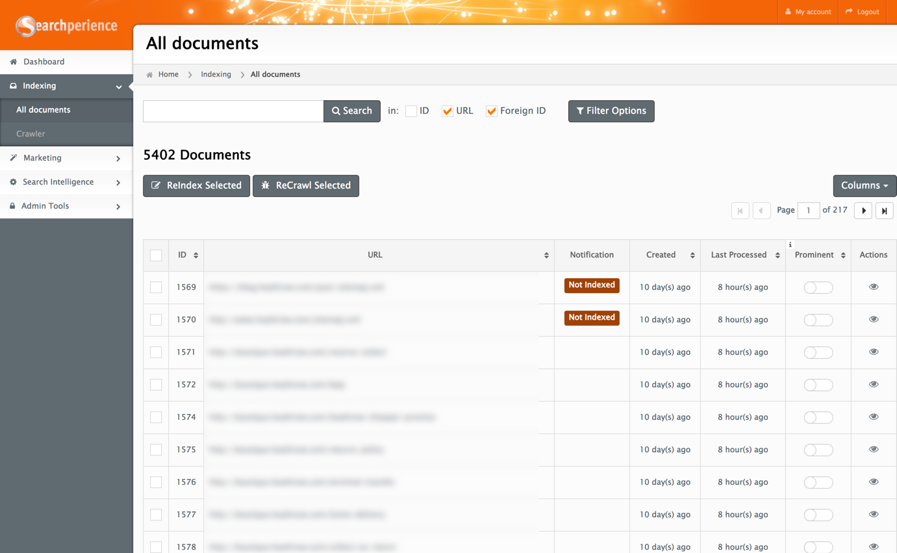
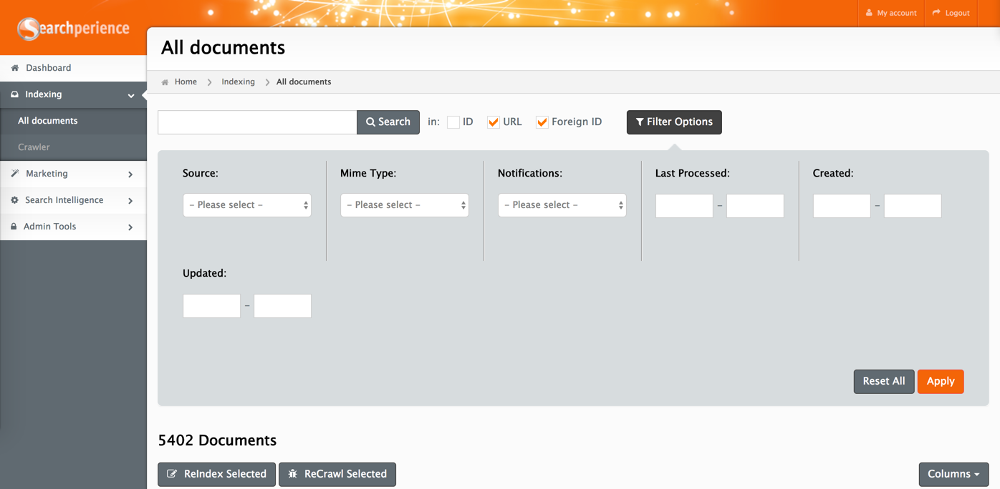
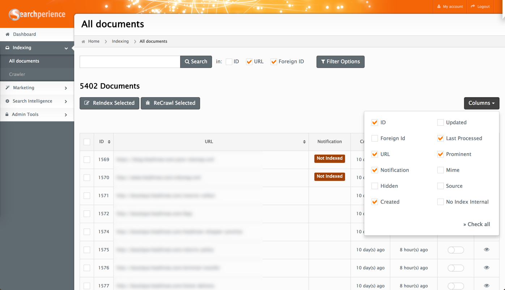
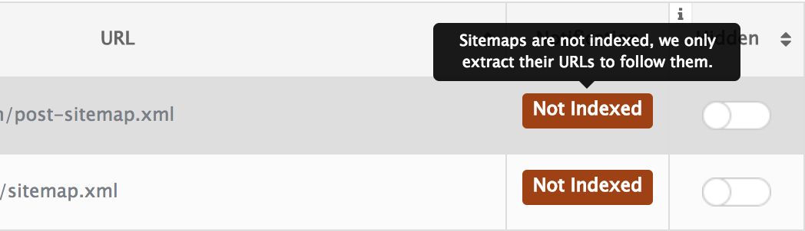
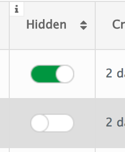
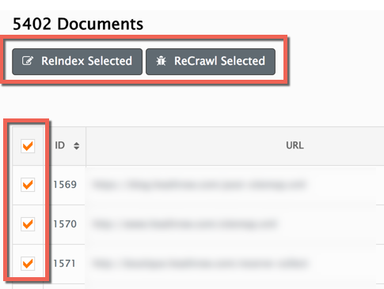
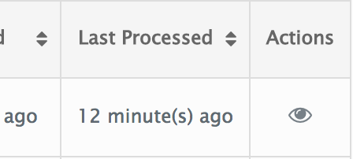
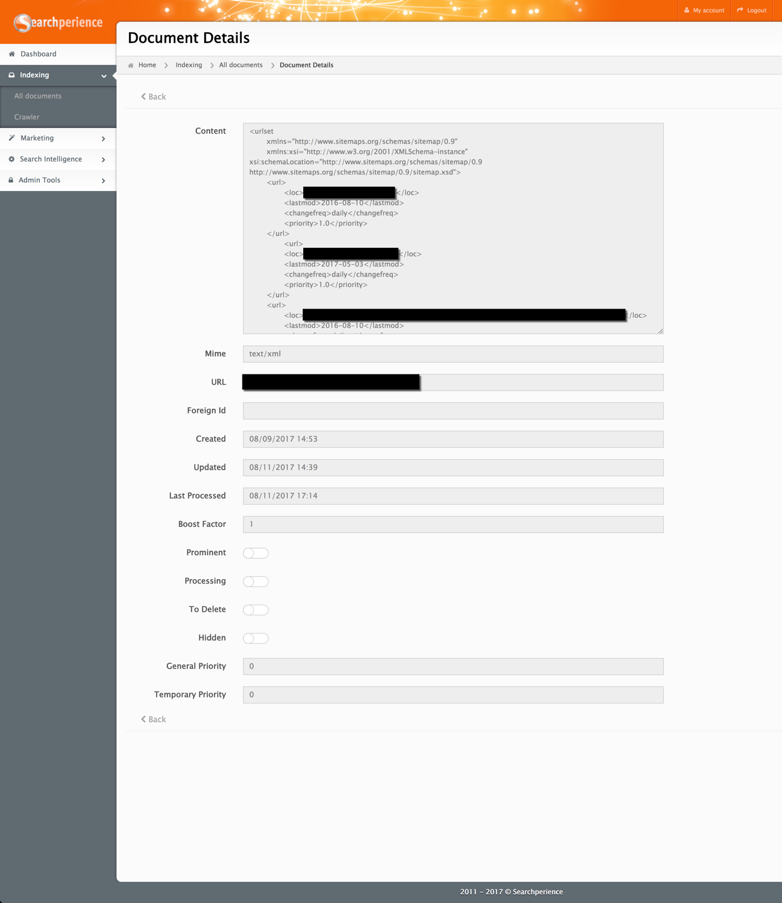

# All Documents

The `All Documents` module gives you an overview about any [documents](../glossary.md#document) available in Searchperience .

!!! note
    Documents that are listed here are within Searchperience as long as they are not marked as `Error`, `Not Indexed`, `Duplicated` or `Redirect`.

## Search & Filters

The easiest way to search for a document is to type the `URL` or `foreignId` of a document in the search box.
In addition to basic search, you can use filters to limit the possible hits. Most common filters are the `Source`[^source] and the [Mime Type](../glossary.md#mime-type) ones.

## The columns

Each user can manage the visibility of the columns displayed by using the `Columns` button above the table.

### Available Columns

| Name              | Value    | Description                                                                                                                                                                                                                      |
|-------------------|:---------|:---------------------------------------------------------------------------------------------------------------------------------------------------------------------------------------------------------------------------------|
| Created           | DateTime | Date the document was created for the first time within Searchperience.                                                                                                                                                          |
| Foreign Id        | String   | A unique identifier. In some cases there is no `foreignId` available for a document, in this case will be a `URL` present.                                                                                                       |
| Hidden            | Boolean  | If active the document gets immediately removed from Searchperience Frontend. This means that the document is still present but not available for searching.                                                                     |
| ID                | Integer  | The internally used identifier.                                                                                                                                                                                                  |
| Last Processed    | DateTime | Date when the document was processed and pushed therefore it became available in Searchperience Frontend.                                                                                                                        |
| Mime              | String   | Technical type that is used during the indexing process to populate all relevant properties.                                                                                                                                     |
| No Index Internal | Boolean  | If the document has been automatically considered as "should not be available" this flag is active. Therefore, the document is not available within Searchperience Frontend for searching.                                       |
| Notification      | String   | There are [different notification](#different-document-notifications) types available that indicate the state of a document. In case this column is empty, the document should be available through the Searchperience Frontend. |
| Source            | String   | Short name of the providing owner/master application managing this document.                                                                                                                                                     |
| Updated           | DateTime | Date in which Searchperience received the last update for this document.                                                                                                                                                         |
| URL               | String   | Absolute URL pointing to the detail view of a document. If no URL is shown a `Foreign Id` should be available. The URL itself is clickable and will open the web page in the current browser.                                    |

### Different Document Notifications

Each notification shows a detailed information on mouse hover.

| Name        | Status                     | Description                                                                                                              |
|-------------|:---------------------------|:-------------------------------------------------------------------------------------------------------------------------|
| Duplicate   | Not visible                | The same document is already available in Searchperience Frontend.                                                       |
| Error       | Not visible                | Error during crawling or processing.                                                                                     |
| Not Indexed | Not visible                | Does not fulfill the configured requirements to being visible in Searchperience Frontend.                                |
| Processing  | Get processed              | This document is currently in processing and will be populated in Searchperience Frontend immediately afterwards.        |
| Redirect    | Not visible                | This `web page` document is serving a HTTP-Redirect to a new target page. The redirect target page will indexed as well. |
| To Delete   | Visible, gets deleted soon | Document is marked for deletion and will be removed from Searchperience soon.                                            |
| Waiting     | Waiting for processing     | The document is marked for processing but still waiting for it to get processed.                                         |

## Document Actions

### Hide a document

Use this toggle to remove a [document](../glossary.md#document) from being available in Searchperience Frontend. If the toggle is used, the document will get processed with high priority. In order to remove it as fast as possible from search results.
To make the document visible in Searchperience Frontend again, just set the toggle to disabled (grey).

### ReCrawl & ReIndex
Usually there is no need to `ReCrawl` or `ReIndex` one ore more documents. Searchperience is configured to maintain the continuous re-crawling and processing of all documents known in the system.

However, if you have a `web page` that you want to have updated immediately, use [Search & Filters](#search-filters) to get to the document, activate the checkbox and hit the `ReCrawl` button.
 

### View documents raw data

The Cockpit `All Documents` module also offers the possibility to display the document raw data.
To open the detail view of a document just click on the `eye` icon under the `Actions` column.

The content area shows the document raw data, this can be in various formats like HTML, XML, JSON.

[^source]: The source of the document is the short textual name of the owner/master application managing the specific document type.
