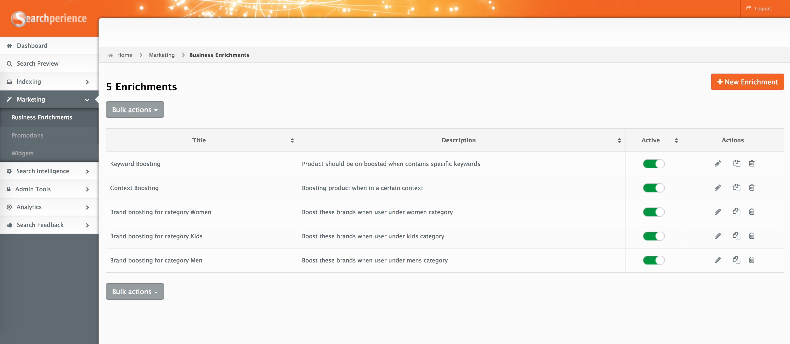
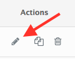
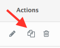
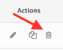
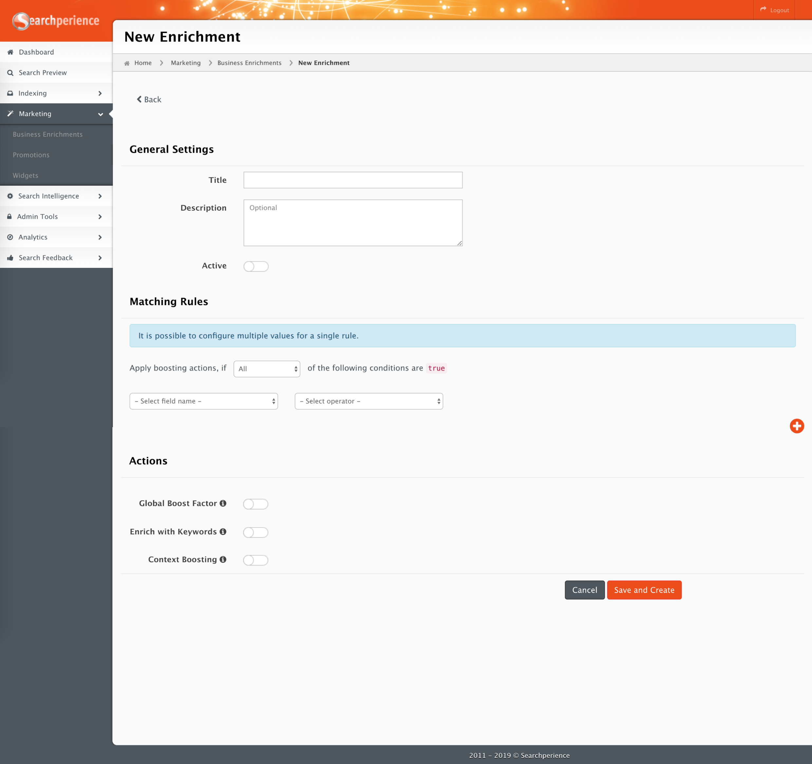
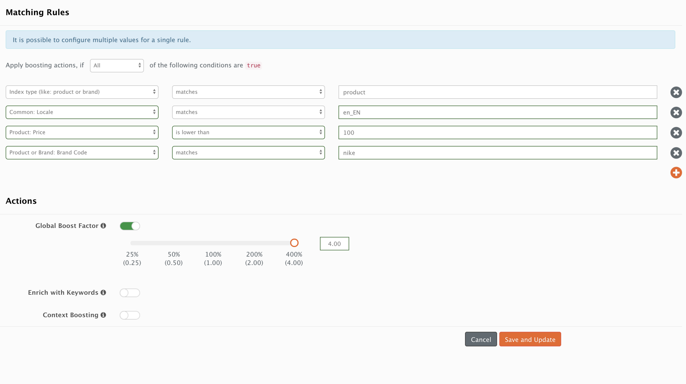
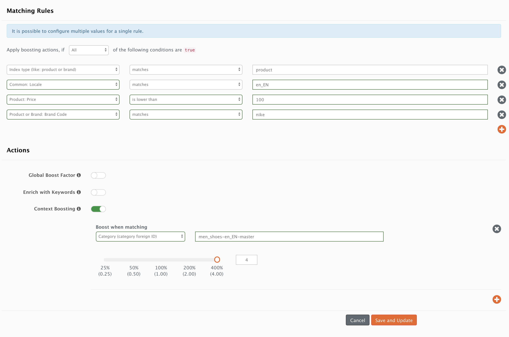

# Business Enrichments

The idea behind `Business Enrichments` is to promote [documents](/glossary.md#document) that match certain rules and adjust their relevance i.e. change their position in search results.

!!! warning
    `Business Enrichments` are a powerful tool for manipulating search results. However, it is possible to get unexpected results in the overall relevance calculation when multiple [matching rules](#matching-rules) match the same set of documents.

!!! info
    `Business Enrichments` will only affect product grids and product result pages.

!!! info
    `Business Enrichments` will only change the priority of products when the sorting is set to `recommended`.

**When to use `Business Enrichments`:**

-   A [document](/glossary.md#document) or set of documents are missing relevant keywords.
-   A [document](/glossary.md#document) or set of documents, which have a promotional campaign assigned to them, should be more relevant in the search results.
-   A [document](/glossary.md#document) or set of documents should appear higher or lower in search results on a specific category.

!!! note
    `Business Enrichments` are applied during document processing, meaning that any changes to an `Enrichment` will trigger a reprocessing. Any documents waiting to be enriched will be marked as [waiting](documents.md#different-document-notifications) and only after the indexing process is done changes will be visible.



## Enrichments Overview Page

!!! info
	Enrichments can only be activated when fully configured. To be fully configured an enrichment has to have at least one matching rule and one boosting action.

| Name        | Description                                                                                                                                                                                                                        |
| ----------- | :--------------------------------------------------------------------------------------------------------------------------------------------------------------------------------------------------------------------------------- |
| Title       | Name of the enrichment, ideally a speaking one.                                                                                                                                                                                    |
| Description | [Optional] Should provide more detailed information about which products will match the enrichment.                                                                                                                                |
| Active      | Toggle control which enables or disables the enrichment.                                                                                                                                                                           |
| Actions     | <ul><li>[Edit](#edit-enrichment) changes the configuration.</li><li>[Copy](#copy-enrichment) re-uses one enrichment to create a new one.</li><li>[Delete](#delete-enrichment) erases the enrichment - can not be undone.</li></ul> |

## Actions

### New 

Open the [new enrichment](#new-enrichment) view to create a new `Business Enrichment`.


### Edit 

The enrichment overview page allows the **editing** of an existing enrichment.



### Copy 

The enrichment overview page allows **copying** an existing enrichment.



### Delete

The enrichment overview page allows **deleting** an existing enrichment.



## Add or edit enrichments

Every `Business Enrichment` has a set of [Matching Rules](#matching-rules) and a set of [actions](#actions_1). These actions are only applied to the matching documents.



### General Settings

| Name        | Description                                                                                         |
| ----------- | :-------------------------------------------------------------------------------------------------- |
| Title       | Name of the enrichment, ideally a speaking one.                                                     |
| Description | [Optional] Should provide more detailed information about which products will match the enrichment. |
| Active      | Toggle control which enables or disables the enrichment.                                            |

### Matching Rules

!!! success "Good Practice"
    It is a good practice to always set `Matching Rules` with the fields `Common: Channel`, `Common: Locale` and `Index type (like: product or brand)` for every enrichment you create.

Every `Business Enrichment` must have a set of `Matching Rules` defined. The rules determine the scope of the documents to which the [actions](#actions_1) should be applied to.
At the very top of the section one can configure how the `Matching Rules` interact with each other. One can specify that `All`, `Any` or `None` of the rules should be `true`.

!!! example
    The following rule boosts any product with a price lower than 100.

    | Field           | Value           |
    | --------------- | :-------------- |
    | Field Selector: | `Price`         |
    | Operator:       | `is lower than` |
    | Input Value:    | `100`           |

!!! note "Multi-values"
    In order to include multiple values in the `Input Values` field, one should use brackets `[ ]` and any values inside should be separated through commas, e.g. `[Nike,Adidas,Puma]`. However, this notation cannot be used with every operator, check the `Multi-value` column in the [operators](#operators) section for more information.  

#### Field Selector

To grasp the idea behind a `Field Selector` one should know how a [document](/glossary.md#document) inside Searchperience looks like. 
The following table includes a list of all available `Field Selector`s and a list of the fields that these selectors match inside a document.  

| Field Selector                                 | Matching Field in Document                                                     |
| ---------------------------------------------- | ------------------------------------------------------------------------------ |
| Common: Channel                                | `channel`                                                                      |
| Common: Foreign Id                             | `foreignId`                                                                    |
| Common: Locale                                 | `locale`                                                                       |
| Index type (like: product or brand)            | Possible values: `product`, `brand`, `category`, `retailer`, `location`, `web` |
| Product or Category or Retailer: Category Path | `categoryPaths`                                                                |
| Product or Category: Category Code             | `categoryCodes`                                                                |
| Product or Retailer: Retailer Code             | `variants[*].retailerCode`                                                     |
| Product: Bangle Size Label                     | `variants[*].attributes.bangleSize_label`                                      |
| Product: Boosted Keywords                      | `allBoostKeywords`                                                             |
| Product: Brand Code                            | `variants[*].attributes.brandCode`                                             |
| Product: Campaign Codes                        | `variants[*].attributes.campaignCodes`                                         |
| Product: Clothing Size Label                   | `variants[*].attributes.clothingSize_label`                                    |
| Product: Color                                 | `variants[*].attributes.baseColor`                                             |
| Product: Duty Free                             | `variants[*].attributes.dutyFree`                                              |
| Product: Exclusive Product                     | `variants[*].attributes.exclusiveProduct`                                      |
| Product: Featured                              | `variants[*].attributes.featured`                                              |
| Product: ISPU Limited to Areas                 | `variants[*].attributes.ispuLimitedToAreas`                                    |
| Product: Keywords                              | `keywords`                                                                     |
| Product: Marketplace Code                      | `allMarketplaceCodes`                                                          |
| Product: Media Reference                       | `variants[*].media`                                                            |
| Product: Price                                 | `sorting.price`                                                                |
| Product: Product Family                        | `productFamily`                                                                |
| Product: Product Type                          | `productType`                                                                  |
| Product: Retailer Category Codes               | `variants.attributes.retailerCategoryCodes`                                    |
| Product: Ring Size Label                       | `variants[*].attributes.ringSize_label`                                        |
| Product: Shoe Size Label                       | `variants[*].attributes.shoeSize_label`                                        |
| Product: Special Offer                         | `variants[*].attributes.specialOffer`                                          |
| Product: Title                                 | `variants[*].title`                                                            |
| Product: Topics                                | `variants[*].attributes.topics`                                                |
| Web: Domain                                    | `domain`                                                                       |
| Web: Url                                       | `url`                                                                          |

Now, let's take a look at the different document types and examine which fields can be used to enrich them.

##### Product Document

!!! note "Variants"
    This product is just an example and it contains just one variant with fields that one would not normally see in a single product e.g. `clothingSize` & `bangleSize`

```json
    {
        "categoryPaths": [
            "Clothing & Accessories/Men's/Tops"
        ],
        "categoryCodes": [
            "clothing",
            "clothing_men"
        ],
        "categoryForeignId": [
            "clothing-en_GB-master",
            "clothing_men-en_GB-master"
        ],
        "updatedAt": "2040-02-22T06:25:31Z",
        "channel": "master",
        "configurableProduct": {
            "internalName": "ATS135 Awesome Searchperience Product",
            "title": "Awesome Searchperience Product",
            "createdAt": "2040-02-22T06:25:31Z",
            "updatedAt": "2040-02-22T06:25:31Z",
            "attributes": {
                "brandCode": "hallifax",
                "brandForeignId": "hallifax-en_GB-master",
                "campaignCodes": [
                    "MultibuyTotal_4for45"
                ],
                "deliveryOptions": [
                    "homeDelivery",
                    "inflightPreorder",
                    "ispu"
                ]
            }
        },
        "variantVariationAttributesSorting": {},
        "productType": "configurable",
        "locale": "en_GB",
        "foreignId": "martRetailer_ATS135-en_GB-master",
        "sorting": {
            "price": 15,
            "sellingCount": {
                "week": 10,
                "month": 45,
                "year": 123
            },
            "viewCount": {
                "week": 21,
                "month": 91,
                "year": 567
            }
        },
        "variantVariationAttributes": [
            "manufacturerColor",
            "clothingSize"
        ],
        "visibilityScope": [
            "catalog",
            "search"
        ],
        "isNew": false,
        "createdAt": "2018-12-03T08:16:10Z",
        "marketplaceCode": "martRetailer_ATS135",
        "allBoostKeywords" : [
            "awesomeProduct",
            "goodValue"
        ],
        "keywords" : [
            "searchperience",
            "product"
        ],
        "allMarketplaceCodes" : [
            "martRetailer_ATS135",
            "martRetailer_9417657621822"
        ]
        "variants": [
            {
                "updatedAt": "2040-12-11T04:43:46Z",
                "shortTitle": "Awesome Searchperience Product Variant",
                "retailerSku": "9417657634522",
                "stockLevel": "high",
                "internalName": "ATS135 Awesome Searchperience Product Variant",
                "retailerCode": "martRetailer",
                "attributes": {
                    "alwaysInStock": "true",
                    "bangleSize": "small_60mm",
                    "bangleSize_label": "Small 60mm",
                    "brandCode": "hallifax",
                    "brandForeignId": "hallifax-en_GB-master",
                    "brandType": "default",
                    "brandName": "Hallifax",
                    "brandToCodeMapping": "Hallifax:hallifax",   "baseColor": [
                        "black"
                    ],
                    "baseColor_label": "Black",
                    "campaignCodes_codeLabel": "Campaign Codes",
                    "campaignCodes": [
                        "MultibuyTotal_4for45",
                        "allPromotions"
                    ],
                    "clothingSize": "s",
                    "clothingSize_label": "S",
                    "collectionOption_codeLabel": "Collection Option",
                    "collectionOption": [
                        "departure"
                    ],
                    "collectionOption_label": "Departure",
                    "dutyFree": "false",
                    "dutyFree_label": "No",
                    "deliveryOptions": [
                        "homeDelivery",
                        "inflightPreorder",
                        "ispu"
                    ],
                    "exclusiveProduct": "true",
                    "exclusiveProduct_label": "Yes",
                    "featured": "false",
                    "featured_label": "No",
                    "manufacturerColor": "Black",
                    "ispuLimitedToAreas" : [
                        "onairport_t4_departure",
                        "onairport_t5_departure_a"
                    ],
                    "retailerCategoryCodes" : [
                        "fashion",
                        "clothing"
                    ],
                    "ringSize": "small_size_k",
                    "ringSize_label": "Small Size K",
                    "shoeSize": "UK_42",
                    "ShoeSize_label": "UK 42",
                    "specialOffer" : true,
                    "topic" : [
                        "xmas",
                        "sale"
                    ]
                },
                "activePrice": {
                    "default": 15,
                    "isDiscounted": false,
                    "currency": "EUR",
                    "context": {
                        "customerGroup": "",
                        "channel": null,
                        "locale": "en_GB"
                    },
                    "denyMoreDiscounts": true,
                    "rulesApplied": [
                        "campaign_code"
                    ]
                },
                "retailerForeignId": "martRetailer-en_GB-master",
                "createdAt": "2018-12-03T08:16:10Z",
                "media": [
                    {
                        "type": "image-api",
                        "mimeType": "image/jpeg",
                        "usage": "detail",
                        "title": "",
                        "reference": "8/b/9/e/8b9e7841ce37bdf123a59757a2c0dc38_ATS135.jpg"
                    }
                ],
                "marketplaceCode": "martRetailer_9417657621822",
                "retailerName": "Mart Retailer",
                "title": "Awesome Searchperience Product Variant",
                "boostKeywords": [
                    "awesomeProduct",
                    "goodValue"
                ],
                "saleableFrom": null,
                "saleableTo": null,
                "isSaleable": true,
                "productFamily": "happyFamily"
            }
        ]
    }
```

The following table displays the `Field Selector`, the corresponding field inside the document and the content of the field that would match.

| Field Selector                                 | Field to Match                                 | Field content                                         |
| ---------------------------------------------- | ---------------------------------------------- | ----------------------------------------------------- |
| Common: Channel                                | `channel`                                      | `master`                                              |
| Common: Foreign Id                             | `foreignId`                                    | `retailer_ATS135-en_GB-master`                 |
| Common: Locale                                 | `locale`                                       | `en_GB`                                        |
| Index type                                     |                                                | one should use `product`                              |
| Product or Category or Retailer: Category Path | `categoryPaths`                                | `[Clothing & Accessories/Men's/Tops]`                 |
| Product or Category: Category Code             | `categoryCodes`                                | `[clothing", "clothing_men]`                          |
| Product or Retailer: Retailer Code             | `variants[*].retailerCode`                     | `martRetailer`                                        |
| Product: Bangle Size Label                     | `variants[*].attributes.bangleSize_label`      | `Small 60mm`                                          |
| Product: Boosted Keywords                      | `allBoostKeywords`                             | `[awesomeProduct, goodValue]`                         |
| Product: Brand Code                            | `variants[*].attributes.brandCode`             | `hallifax`                                            |
| Product: Campaign Codes                        | `variants[*].attributes.campaignCodes`         | `[MultibuyTotal_4for45, allPromotions]`               |
| Product: Clothing Size Label                   | `variants[*].attributes.clothingSize_label`    | `S`                                                   |
| Product: Color                                 | `variants[*].attributes.baseColor`             | `[black]`                                             |
| Product: Duty Free                             | `variants[*].attributes.dutyFree`              | `false`                                               |
| Product: Exclusive Product                     | `variants[*].attributes.exclusiveProduct`      | `true`                                                |
| Product: Featured                              | `variants[*].attributes.featured`              | `false`                                               |
| Product: ISPU Limited to Areas                 | `variants[*].attributes.ispuLimitedToAreas`    | `[onairport_t4_departure,onairport_t5_departure_a]`   |
| Product: Keywords                              | `keywords`                                     | `[searchperience,product]`                            |
| Product: Marketplace Code                      | `allMarketplaceCodes`                          | `[martRetailer_ATS135, martRetailer_9417657621822]`   |
| Product: Media Reference                       | `variants[*].media.reference`                  | `8/b/9/e/8b9e7841ce37bdf123a59757a2c0dc38_ATS135.jpg` |
| Product: Price                                 | `sorting.price`                                | `15`                                                  |
| Product: Product Family                        | `productFamily`                                | `happyFamily`                                         |
| Product: Product Type                          | `productType`                                  | `configurable`                                        |
| Product: Retailer Category Codes               | `variants[*].attributes.retailerCategoryCodes` | `[fashion,clothing]`                                  |
| Product: Ring Size Label                       | `variants[*].attributes.ringSize_label`        | `Small Size K`                                        |
| Product: Shoe Size Label                       | `variants[*].attributes.shoeSize_label`        | `UK 42`                                               |
| Product: Special Offer                         | `variants[*].attributes.specialOffer`          | `true`                                                |
| Product: Title                                 | `variants[*].title`                            | `Awesome Searchperience Product Variant`              |
| Product: Topics                                | `variants[*].attributes.topics`                | `[xmas,sale]`                                         |

##### Brand Document

```json
{
    "document": {
        "foreignId": "bombay-sapphire-en_GB-master",
        "locale": "en_GB",
        "channel": "master",
        "code": "bombay-sapphire",
        "type": "featured",
        "title": "Bombay Sapphire",
        "media": [
            {
                "type": "image-api",
                "mimeType": "image/jpg",
                "usage": "logo",
                "title": "Front View",
                "reference": "/media/images/89/white.jpg"
            }
        ],
        "keywords": []
    },
    "highlights": {}
}
```

| Field Selector     | Field to Match | Result                                |
| ------------------ | -------------- | ------------------------------------- |
| Common: Channel    | `channel`      | `master`                              |
| Common: Foreign Id | `foreignId`    | `bombay-sapphire-en_GB-master` |
| Common: Locale     | `locale`       | `en_GB`                        |
| Index type         |                | one should use `brand`                |

##### Category Document

```json
 {
    "foreignId": "technology_camera_actioncams-en_GB-master",
    "locale": "en_GB",
    "channel": "master",
    "path": "Technology/Camera & Video/Action Cameras",
    "code": "technology_camera_actioncams",
    "media": [],
    "label": "Action Cameras",
    "isPromoted": false,
    "parentCategoryCode": "technology_camera",
    "categoryType": "ProductCategory",
    "title": "Action Cameras"
}
```

| Field Selector     | Field to Match | Result                                             |
| ------------------ | -------------- | -------------------------------------------------- |
| Common: Channel    | `channel`      | `master`                                           |
| Common: Foreign Id | `foreignId`    | `technology_camera_actioncams-en_GB-master` |
| Common: Locale     | `locale`       | `en_GB`                                     |
| Index type         |                | one should use `category`                          |

##### Retailer Document

```json
{
    "foreignId": "icebreaker-en_GB-master",
    "code": "icebreaker",
    "categoryPaths": [
        "collection-point"
    ],
    "channel": "master",
    "locale": "en_GB",
    "title": "Icebreaker",
    "terminals": [
        "I"
    ],
    "email": "icebreaker@online.com"
}
```
| Field Selector     | Field to Match | Result                           |
| ------------------ | -------------- | -------------------------------- |
| Common: Channel    | `channel`      | `master`                         |
| Common: Foreign Id | `foreignId`    | `icebreaker-en_GB-master` |
| Common: Locale     | `locale`       | `en_GB`                   |
| Index type         |                | one should use `retailer`        |

##### Location Document

```json
{
    "code": "world-duty-free-t5",
    "brands": [
        "prada",
        "dolce-and-gabbana",
        "bulgari",
        "cartier"
    ],
    "channel": "master",
    "pickup": true,
    "media": [
        {
            "reference": "/media/images/7/CHE13789d.jpg",
            "usage": "heroImage",
            "mimeType": "image/jpg",
            "type": "image-api",
            "title": "Front View"
        }
    ],
    "locale": "en_GB",
    "title": "World Duty Free, T5, Level 2 / Gate A8",
    "foreignId": "world-duty-free-t5-en_GB-master",
    "airportZone": {
        "area": "A",
        "level": 2,
        "landside": false,
        "schengen": false,
        "terminal": "5",
        "title": "T5, Airside, Level , Gates A1 - A23"
    },
    "email": "om3.sandra.flamingo@gmail.com"
}
```
| Field Selector     | Field to Match | Result                                   |
| ------------------ | -------------- | ---------------------------------------- |
| Common: Channel    | `channel`      | `master`                                 |
| Common: Foreign Id | `foreignId`    | `world-duty-free-t5-en_GB-master` |
| Common: Locale     | `locale`       | `en_GB`                           |
| Index type         |                | one should use `location`                |

#### Operators 

An operator controls how the value in the document's field is compared to the `Input Value`.

!!! info "Input Values"
    Check `Field Selector` examples above to have an idea how the `Input Value` should look like. For specific use cases, find an example of the document you want to match. A of how to do this can be found in the [Documents](documents.md) section.

| Operator            | Description                                                                                                                                                                                | Multi-value |
| ------------------- | :----------------------------------------------------------------------------------------------------------------------------------------------------------------------------------------- | :---------- |
| `matches`           | Case sensitive match of the value in the document and the `Input Value`.                                                                                                                   | yes         |
| `contains`          | Case insensitive match, the `Input Value` is either contained or equal to the value in the document.                                                                                       | yes         |
| `does not equal`    | Case sensitive difference of the value in the document and the `Input Value`.                                                                                                              | yes         |
| `does not contains` | Case insensitive difference, the `Input Value` is neither contained nor equal to the value in the document.                                                                                | yes         |
| `is greater than`   | Numeric comparison between the value in the document and the `Input Value`. If the value in the document or the `Input Value` do not contain a numeric value it will be considered as `0`. | no          |
| `is lower than`     | Numeric comparison between the value in the document and the `Input Value`. If the value in the document or the `Input Value` do not contain a numeric value it will be considered as `0`. | no          |
| `is empty`          | Check if the document's field is empty or if the field does not exist inside the document.                                                                                                 | -           |

!!! info "In Range Of"
    Enrichments do not offer an `in range of` operator. However, it is possible to replicate this operation by using `is greater than` and `is lower than`.

For the next example, one should think of a document with the following fields.

```json
    {
        "title": "Cool clothing piece",
        "categoryCodes": [
            "men",
            "women",
            "kids"
        ],
        "isExclusive" : true,
        "price" : 89.99,
        "ringSize": "62 mm",
        "media" : []
    }
```

The following table gives an overview of how matching works between different field names, operators, and input values.

| Field Name      |   Operator    |       Input Value       | Matches |
| --------------- | :-----------: | :---------------------: | :------ |
| `title`         |   `matches`   |  `Cool clothing piece`  | Yes     |
| `title`         |   `matches`   |  `cool clothing piece`  | No      |
| `title`         |   `matches`   | `[Cool clothing piece]` | Yes     |
| `title`         |  `contains`   |       `clothing`        | Yes     |
| `title`         |  `contains`   |       `Clothing`        | Yes     |
| `title`         |  `contains`   |      `[Clothing]`       | Yes     |
| `categoryCodes` |   `matches`   |          `men`          | Yes     |
| `categoryCodes` |   `matches`   |          `Men`          | No      |
| `categoryCodes` |   `matches`   |         `[men]`         | Yes     |
| `categoryCodes` |   `matches`   |      `[boys,men]`       | Yes     |
| `categoryCodes` |  `contains`   |          `kid`          | Yes     |
| `categoryCodes` |  `contains`   |         `[kid]`         | Yes     |
| `categoryCodes` |  `contains`   |      `[baby,kid]`       | Yes     |
| `isExclusive`   |   `matches`   |         `true`          | Yes     |
| `isExclusive`   |   `matches`   |         `True`          | No      |
| `price`         |   `matches`   |         `89.99`         | Yes     |
| `price`         | `lower than`  |          `men`          | No      |
| `price`         | `lower than`  |          `100`          | Yes     |
| `price`         | `lower than`  |         `[100]`         | Yes     |
| `ringSize`      | `lower than`  |          `100`          | Yes     |
| `price`         | `higher than` |          `men`          | No      |
| `price`         | `higher than` |          `80`           | Yes     |
| `price`         | `higher than` |        `[80,90]`        | No      |
| `ringSize`      | `higher than` |          `50`           | Yes     |
| `title`         |  `is empty`   |            -            | No      |
| `media`         |  `is empty`   |            -            | Yes     |
| `retailer`      |  `is empty`   |            -            | Yes     |


### Actions

#### Global Boost Factor
By changing the boost factor, it is possible to influence the ranking score of documents. The default value of 100% (1.0) suggest no change in the ranking score and therefore it is not considered as a configuration.

!!! example
    - A boost factor of 300% (3.0) means the ranking score will be increased by 200%.
    - A boost factor of 25% (0.25) means the ranking score will be reduced by 75%.

#### Enrich with Keywords
By enriching any matching documents with specific keywords, the ranking of the documents will be increased when a user searches for the same keywords. One can differentiate between 3 groups of keywords:

-   low boosted: + 25% boosting
-   normal boosted: + 50% boosting
-   high boosted: + 100% boosting

#### Context Boosting
`Context Boosting` increases product's relevance based on a specific context, i.e. a category or brand page.

!!! note
    When using `Context Boosting` you need to reference a specific `category` or `brand` through their foreign Ids. Use `categoryForeignId`[^categoryForeignId] for categories and `brandForeignId`[^brandForeignId] for brands.

!!! note
    It is not necessary to set the `Global Boost Factor` when using Context Boosting.

`Context Boosting` should be used when applying enrichments to an specific context. 
Due to technical constraints, using multiple "normal" enrichments on different sub-categories delivers unexpected results.

##### Example
To get a better idea about the differences between `Global Boost Factor` and `Context Boosting`, check the following example:

Boost any `Nike` products with the filter `"Product or Brand : Brand Code" - "matches" - "Nike"` when the user is in the `"men_shoes-en_GB-master"` category.

!!! example
    **1) Enrichment with Global Boost Factor**

    * Matching rule
        * Index type is `product`
        * Locale is `en_GB`
        * Price lower than `100`
        * Brand is `Nike`
    * Actions
        * Global Boost Factor is `400%`



!!! example
    **2) Enrichment with Context Boosting**

    * Matching rule
        * Index type is `product`
        * Locale is `en_GB`
        * Price lower than `100`
        * Brand is `Nike`
    * Actions
        * Context Boosting
            * Category is `men_shoes-en_GB-master`[^categoryForeignId]
                * Boost Factor is `400 %`



**How would these two enrichments behave?**

The first enrichment will boost any products with a price lower than 100 by 400%. In other words: When one finds a product cheaper than 100, the product is placed much higher in the search results.

The second enrichment will also boost any products by `"nike"` with a price lower than 100 by 400%. However, this only happens when the user is inside the category page with the foreign Id `"men_shoes-en_GB-master"`.

[^categoryForeignId]:
  A category foreign Id is built from `category code`, `locale` and `channel` connected together with a `-` sign. E.g. `category_code-en_GB-master`.
[^brandForeignId]:
  A brand foreign Id is built from `brand code`, `locale` and `channel` connected together with a `-` sign. E.g. `brand_code-en_GB-master`.
