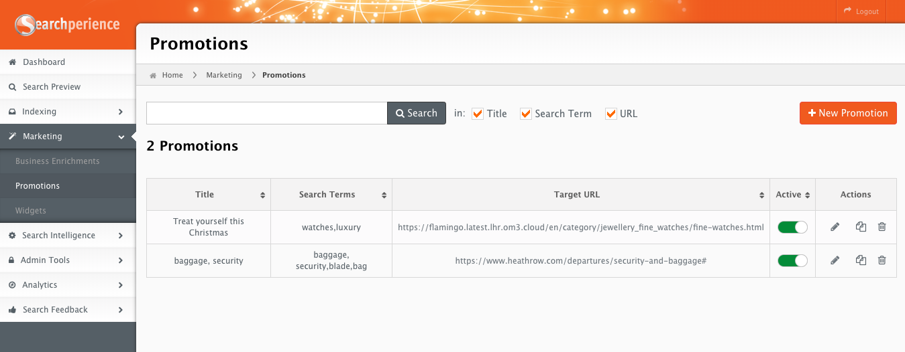
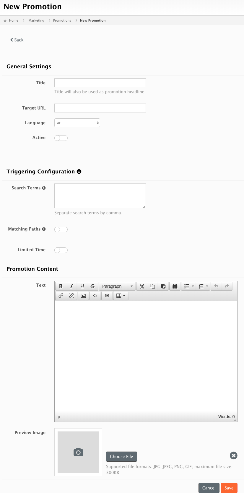
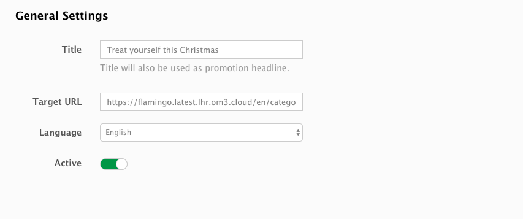
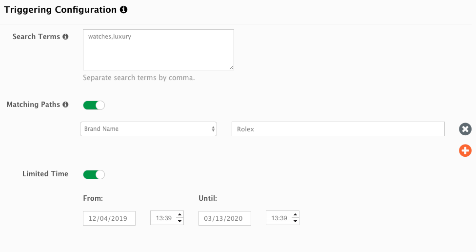
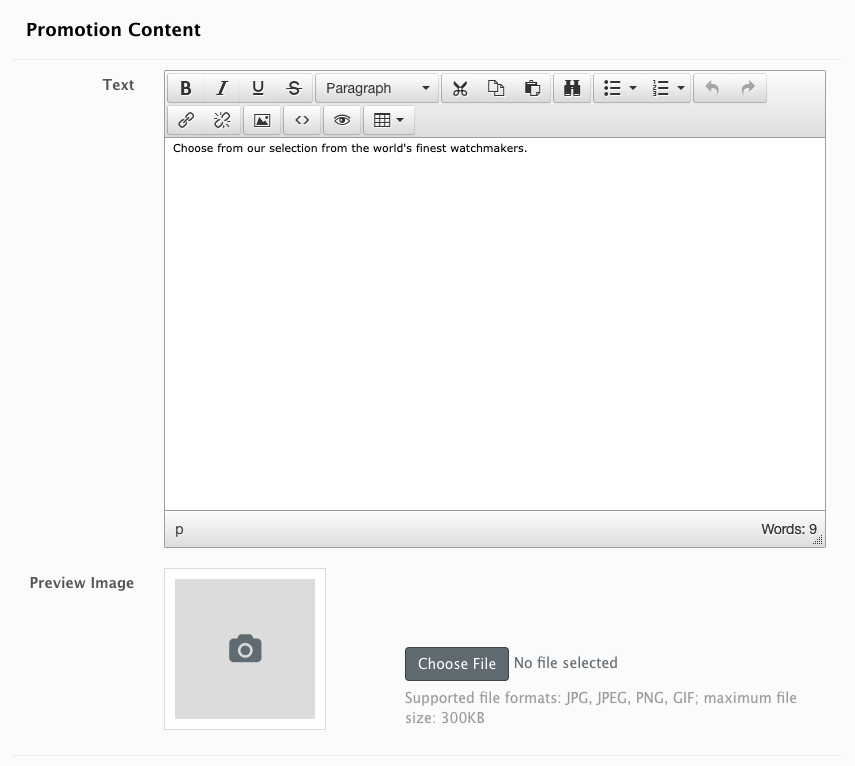

# Promotions

Promotions allow to create predefined search results that are attached to one or a set of search terms.

!!! tip ""
	Promotions are a special type of search results and have their own field in the search response.
	Promotions can be used to point users to campaigns, informational information or external web pages.

## When are promotions shown?

Promotions are shown when the search term (via a search query) or a matching path (via a search facet) matches the user's search criteria.

## Promotions Overview

| Name         | Description                                                                                                                                                                 |
| ------------ | :-------------------------------------------------------------------------------------------------------------------------------------------------------------------------- |
| Title        | Title of the promotion.                                                                                                                                                     |
| Search Terms | [Optional] Search terms for which the promotion will appear.                                                                                                                |
| Target URL   | Link where the promotion leads to.                                                                                                                                          |
| Active       | Toggle to enable or disable the promotion.                                                                                                                                  |
| Actions      | <ul><li>Edit to change the configuration.</li><li>Copy to re-use one promotion to create a new one.</li><li>Delete to erase the promotion. It can not be undone.</li></ul>  |

## Add a new Promotion

A new promotion can be added by using the top right button . Afterwards, a form will appear allowing to configure a new promotion.

### General Settings

| Name         | Description                                |
| ------------ | :----------------------------------------- |
| Title        | Title of the promotion.                    |
| Target URL   | Link where the promotion leads to.         |
| Language     | Language the promotion should match with.  |
| Active       | Toggle to enable or disable the promotion. |

### Triggering Configuration

You can define here when and where the promotion should be displayed:

| Name           | Description                                                                                                                                                                                                                               |
| -------------- | :---------------------------------------------------------------------------------------------------------------------------------------------------------------------------------------------------------------------------------------- |
| Search Terms   | Search terms for which the promotion will appear.                                                                                                                                                                                         |
| Matching Paths | Paths e.g. category, brand names for which the promotion shall appear.                                                                                                                                                                    |
| Limited Time   | Time period in which a promotion should appear in. It is possible to prepare promotions in advance so that they appear at a later date. To accomplish this the `from` and `until` values need to be filled with a future date/time range. |

!!! note ""
    You must define at least one search term or a matching path. You can also use both at the same time, in that case the promotion will only be found if both of those criteria match.

In the above screen the promotion will appear only if the user uses one of the search terms `watches`,`luxury` AND selects the option `Rolex` in the brand facet.

### Promotion Content

Here it is possible to configure the text and image shown to the user. Text can be edited through the text editor, which supports basic styling and adding links.

