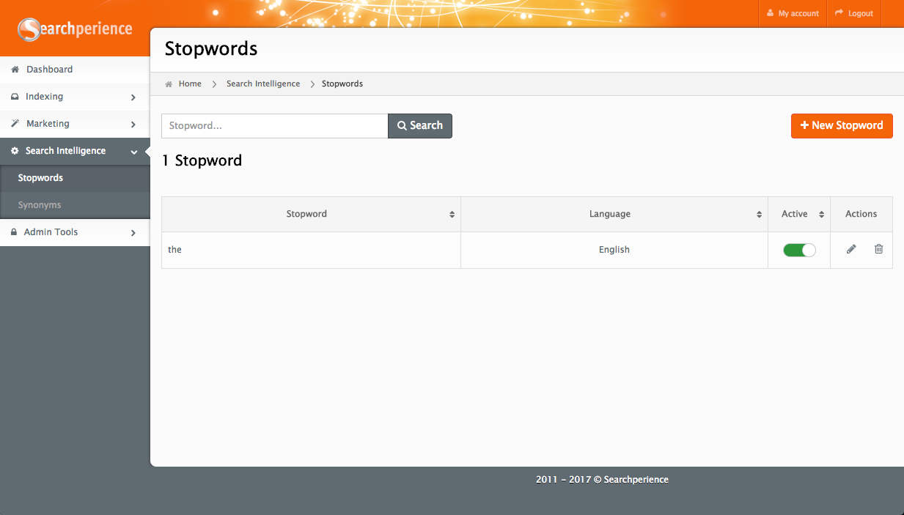
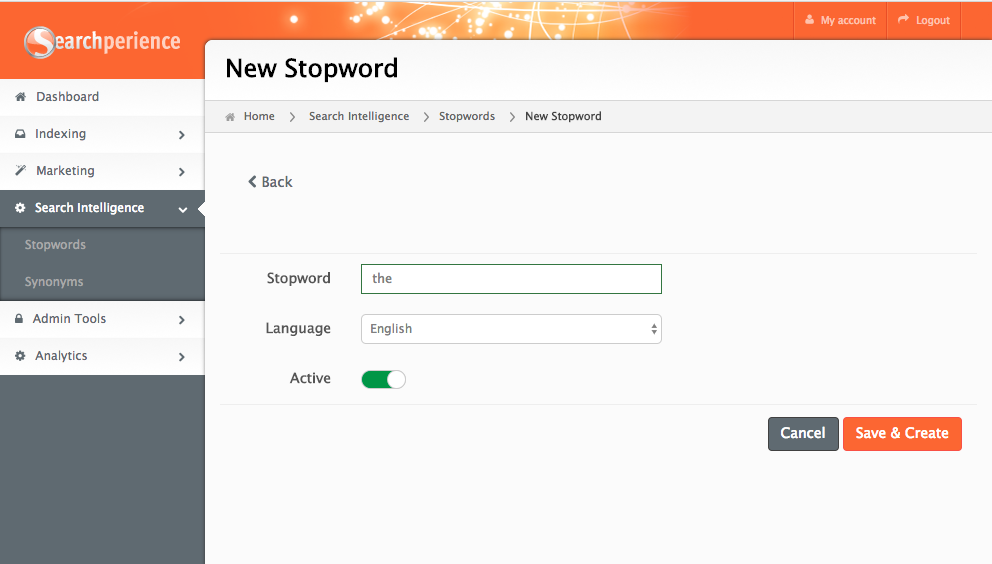

# Custom Stopwords Module

The custom stopwords module provides an easy way to manage custom [stopwords](../glossary.md#stopword) within Searchperience. [Stopwords](../glossary.md#stopword) are considered while performing a search query[^searchQuery] using the search page. 

!!! note ""
	Stopwords are not considered when serving [widgets](../glossary.md#widget) or any non-search related [endpoint](../glossary.md#endpoint) in [Frontend](../glossary.md#frontend).

## The columns

| Name     | Description                                                                    |
|----------|:-------------------------------------------------------------------------------|
| Stopword | Name of the stopword.                                                          |
| Language | Stopword's language.                                                           |
| Active   | Toggle to enable or disable the record.                                        |
| Actions  | <ul><li>Edit to change the configuration.</li><li>Delete one record.</li></ul> |

## Add a new Stopword
New [stopwords](../glossary.md#stopword) are added using the top right button  which leads to the following form to configure a new [stopword](../glossary.md#stopword).

[^searchQuery]: More information about [search queries on Wikipedia](https://en.wikipedia.org/wiki/Web_search_query)