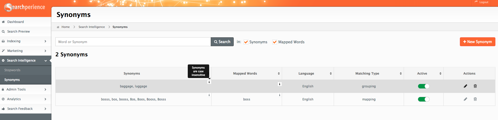
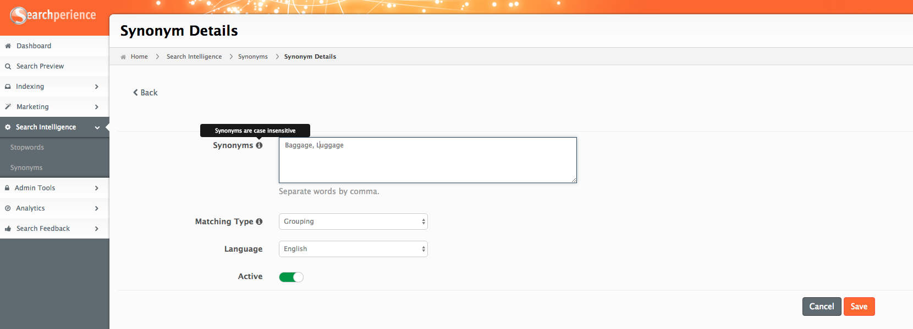
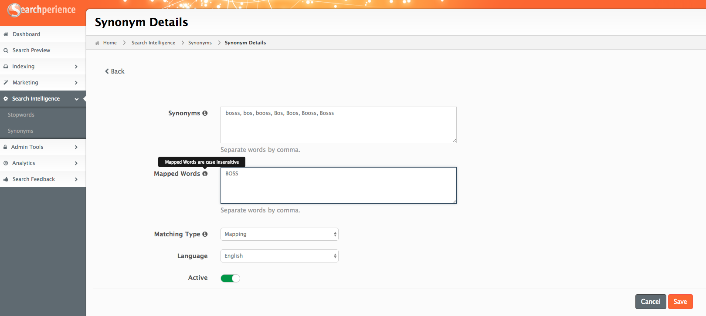

# Synonyms

Synonyms provide an easy way to manage [synonyms](../glossary.md#synonym) within Searchperience.

!!! tip "Use Case"
     When a user searches for “the US”, he expects to find documents that contain United States, USA, U.S.A., America. 

## The columns

| Name          | Description                                                                        |
|---------------|:-----------------------------------------------------------------------------------|
| Synonyms      | List of configured [synonyms](../glossary.md#synonym).                             |
| Mapped Words  | List of words the [synonyms](../glossary.md#synonym) get mapped into.              |
| Language      | The language.                                                                      |
| Matching Type | Can be of type <ul><li>[Grouping](#grouping)</li><li>[Mapping](#mapping)</li></ul> |
| Active        | Toggle to enable or disable the record.                                            |
| Actions       | <ul><li>Edit to change the configuration.</li><li>Delete one record.</li></ul>     |

!!! Note
    Synonyms and Mapped Words are case insensitive.

## Add or edit a Synonym

### Grouping
The option `Grouping` of [synonyms](../glossary.md#synonym) is used to define a list of words where Searchperience will search for as soon as one of the words out of the list is entered into the search. This means when a user is searching for `Baggage` internally Searchperience is searching for both words `Baggage` and `Luggage` to find matching [documents](../glossary.md#document).

### Mapping
The option `Mapping` defines in the following example that on the search terms `bosss`, `bos`, etc. Searchperience will use `BOSS` to find the matching [documents](../glossary.md#document) that should be returned to the user.

