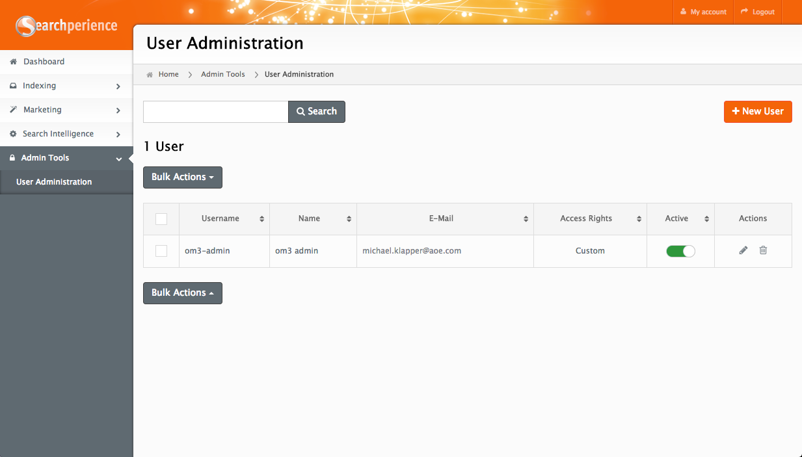
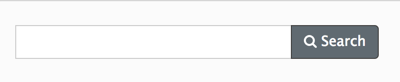
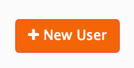
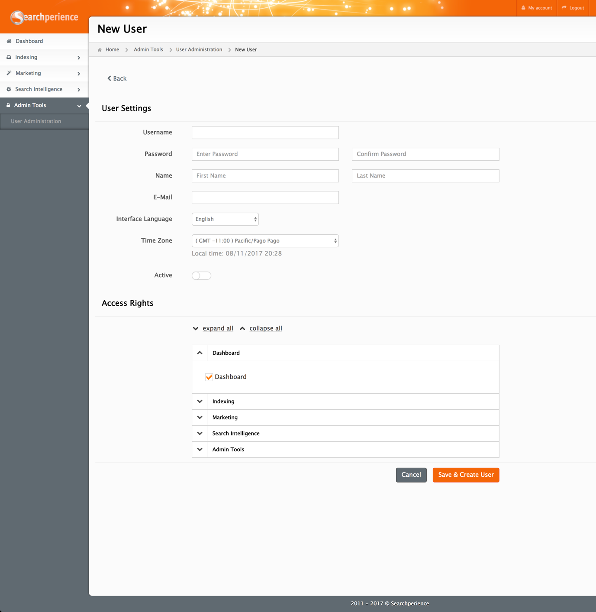
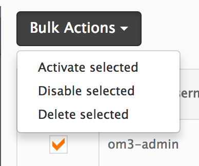
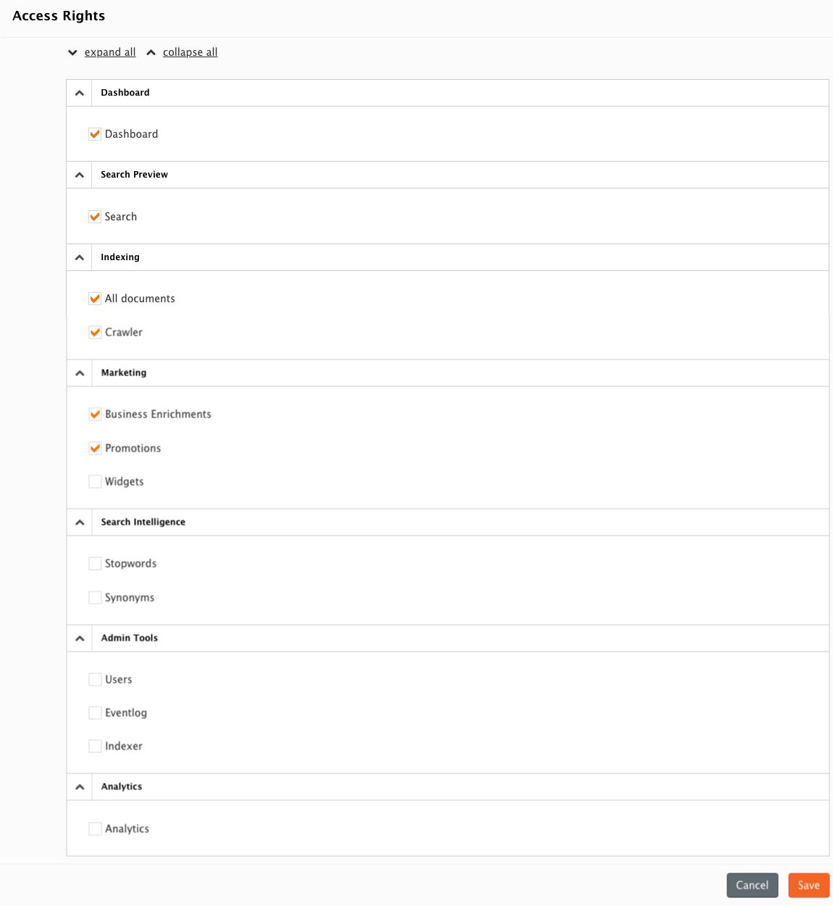

# User Administration

!!! Note
    Not all users will have access to the `User Administration` module.

## Search
The simple search available within the `User Administration` gives you the option to search for users by `Username`.

## The Columns
| Name          | Description                                                                                                                                              |
|---------------|:---------------------------------------------------------------------------------------------------------------------------------------------------------|
| Username      | The unique name used to login to the Searchperience Cockpit.                                                                                             |
| Name          | The real name of the user.                                                                                                                               |
| E-Mail        | The E-Mail address of the user.                                                                                                                          |
| Access Rights | Usually set to `custom` which means that the user got individual rights assigned.                                                                        |
| Actions       | <ul><li>There is the option to access the `edit mode` to adjust the information and permissions of a user.</li> <li>Deletion of a single user.</li></ul> |

## Available Actions

### Add New User
In the top right of the module there is the `+ New User` button that will open the new user page where all the details can be entered. 

* The first section `User Settings` is used to add the users basic information.
* The second section `Access Rights` is the possible modules that can be assigned to a users.

### Bulk Actions
The list view of the `User Administration` offers some bulk actions to that can be applied to any user in the list shown by selecting them via the checkbox.

!!! warning
    It is also possible to select the own user and apply any action on it, this may result to a self delete/de-activate.

| Name              | Description                                                   |
|-------------------|:--------------------------------------------------------------|
| Activate selected | Activates one or more users that are set to disabled at once. |
| Disable selected  | Disables one or more active users at once.                    |
| Delete selected   | Deletes one or more users at once (they cannot be restored).  |

## Access Rights

The section `Access Rights` defines all available modules to the user.

!!! note
    Any user must have access to the [Dashboard], otherwise access is denied after login. 

| Category            | Module Name            | Short Description                                                                                                          |
|:--------------------|:-----------------------|:---------------------------------------------------------------------------------------------------------------------------|
| Dashboard           | [Dashboard]            | Module shown right after login, provides quick overview and access to relevant modules.                                    |
| Search Preview      | Search                 | Module to test a search.                                                                                                   |
| Indexing            | [All Documents]        | Module to provide an overview about the known [documents](../glossary.md#documents) within Searchperience and their state. |
| Indexing            | [Crawler]              | Module to provide an overview about the URL queue (the documents that will be created from web page crawling).             |
| Marketing           | [Business Enrichments] | Module to manage enrichments.                                                                                              |
| Marketing           | [Promotions]           | Module to manage promotions.                                                                                               |
| Marketing           | [Widgets]              | Module to manage [widgets](../glossary.md#stopword).                                                                       |
| Search Intelligence | [Stopwords]            | Module to manage [stopwords](../glossary.md#stopword).                                                                     |
| Search Intelligence | [Synonyms]             | Module to manage [synonyms](../glossary.md#synonym).                                                                       |
| Admin Tools         | [Users]                | Module for Cockpit user administration.                                                                                    |
| Admin Tools         | Eventlog               | Module where the event log is shown.                                                                                       |
| Admin Tools         | Indexer                | Module to interact with the Searchperience Indexer.                                                                        |
| Analytics           | Analytics              | Module for analytics.                                                                        |

[Dashboard]: dashboard.md
[All Documents]: documents.md
[Crawler]: crawler.md
[Business Enrichments]: enrichments.md
[Promotions]: promotions.md
[Widgets]: widgets.md
[Stopwords]: stopwords.md
[Synonyms]: synonyms.md
[Users]: synonyms.md