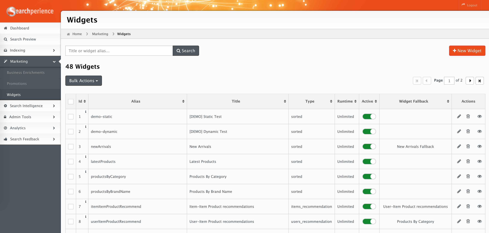
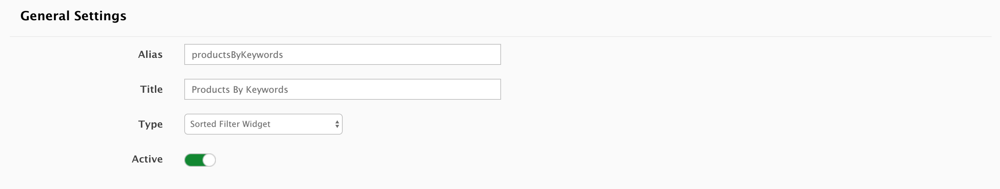
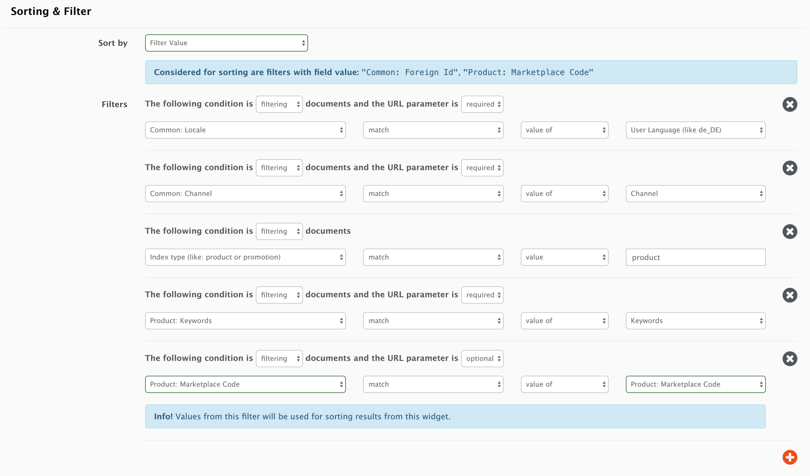
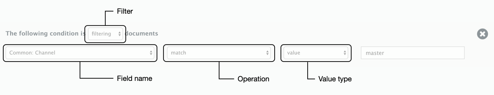
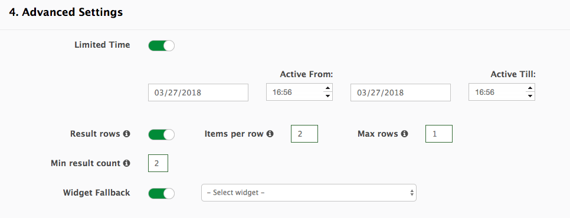
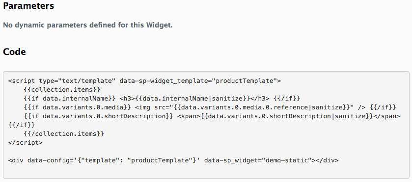
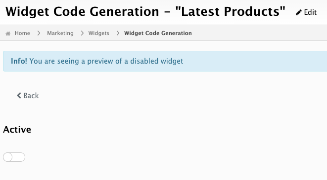

# Widgets

The idea behind [`Widgets`](../glossary.md#widget) is to return a filtered set of [documents](../glossary.md#document) which can be used in different scenarios.

**When to use `Widgets`:**

-   To obtain data from Searchperience from a custom JavaScript Application.
-   To create a teaser component on your web site, the teaser can include items like "Most Sold Products", "Similar Products", and more.

## Widgets Overview



## Add or edit a Widget

1. Log into Searchperience Cockpit 
2. Under `Marketing`, select `Widgets` to see a list of all available Widgets.
3. Create a new widget (`+ New Widget`) or edit an existing one (click on the pen under `Actions`).

!!! note
    When updating an existing `Widget` it might occur that data matching your old configuration gets returned right after saving.
    Wait 10 seconds and then reload the preview page again.

## General Settings

Set the `Alias`, `Title` and `Type` of the widget, and activate it (once it's ready).



At the moment, possible options for `Type` include:

| Type                            | Description                                                                                                                                                                                                                                                                                  |
|---------------------------------|----------------------------------------------------------------------------------------------------------------------------------------------------------------------------------------------------------------------------------------------------------------------------------------------|
| `Sorted Filter`                 | The results of this widget will be sorted based on the option selected in `Sort by`.                                                                                                                                                                                                         |
| `Item Recommendation`           | The results of this widget come from the Searchperience Recommender, the widget will require a item foreignId for every request and return similar items.                                                                                                                                    |
| `User Recommendation`           | The results of this widget come from the Searchperience Recommender, the widget will require a userId for every request and return a set of items that this user may like.                                                                                                                   |
| `More like This Recommendation` | The results of this widget are a set of similar items as computed by the search engine. This similarity differs from the recommendation one in that it is computed based on the content of the document's fields and not on user interactions as computed by the Searchperience Recommender. |
| `Feed Widget`                   | Returns a shorter syntax than the normal widgets.                                                                                                                                                                                                                                            |
| `User Profile`                  | Check the [personalised widgets](#personalised-widgets) section for more info.                                                                                                                                                                                                               |

Keep in mind that independently of the widget's `Type` any configured filters will adjust the results.

## Sorting & Filter



### Sorting

`Sort by` allows to configure how the widget's results should be sorted.

Sorting options:

!!! info "Selling and View counts"
    Data for these metrics is collected by the Searchperience Tracker and calculated inside Searchperience.

| Name                    | Description                                                                                                                               |
|-------------------------|:------------------------------------------------------------------------------------------------------------------------------------------|
| Relevance               | Sort by relevance score (document's relevance is calculated per request, based on the filters provided).                                  |
| Latest                  | Sort by newest documents (The meaning of "newest" is configurable).                                                                       |
| Product Price           | Sort by product's price.                                                                                                                  |
| Random                  | Random sorting.                                                                                                                           |
| Selling count per week  | Sort by the number of times a product was sold in the last 7 days.                                                                        |
| Selling count per month | Sort by the number of times a product was sold in the last 28 days.                                                                       |
| Selling count per year  | Sort by the number of times a product was sold in the last 365 days.                                                                      |
| View count per week     | Sort by the number of times a product was clicked in the last 7 days.                                                                     |
| View count per month    | Sort by the number of times a product was clicked in the last 28 days                                                                     |
| View count per year     | Sort by the number of times a product was clicked in the last 368 days.                                                                   |
| Title ASC               | Sort by the product's title in ascending order.                                                                                           |
| Filter Value            | Sort by the values in a specific filter. After selecting this option, a info message will indicate which filters can be used for sorting. |


### Filters

Additionally, one or more filters can be added to a widget. Filters affect which documents are part of the results.

Filters can be:

| Name      | Description                                                                                                                                                                                                                                                                                                                      |
|-----------|:---------------------------------------------------------------------------------------------------------------------------------------------------------------------------------------------------------------------------------------------------------------------------------------------------------------------------------|
| Filtering | Documents that match this filter will be in the results set.                                                                                                                                                                                                                                                                     |
| Excluding | Documents that match this filter will not be in the result set.                                                                                                                                                                                                                                                                  |
| Boosting  | Documents that match this filter will be boosted so they appear closer to the top. Sensible values are between 0 and 10, decimal values are allowed. Any value above 1 will improve the relevance of matched documents, values between 0 and 1 will lower the relevance of matched documents. Negative values are not supported. |

Filters consist of these fields:

!!! success "Good Practice"
    It is a good practice to always set filters with the fields `Common: Channel`, `Common: Locale` and `Index type (like: product or brand)` for every widget you create.



| Name               | Description                                                                                              |
|--------------------|:---------------------------------------------------------------------------------------------------------|
| Field name         | Field used to filter results. See [Field names](#field-names).                                           |
| Operation          | Defines how the input value should be compared with the value of the field in the document.              |
| Value type         | Defines if filter value is predefined `value` or needs to be provided in the URL `value of`.                                |
| Value              | When value type set to `value`. Defines the input value used for the operation.                                                          |
| Parameter behavior | When value type set to `value of`. It defines if the filter parameter is required or not i.e. it is possible to leave it out from the request. |

_Operation_ can be one of:

!!! info "In range of + value of"
    When using the "in range of" operation in combination with `value of` type the value provided by the user needs to be in format "50::100" (indicating a range between 50 and 100).

| Name        | Description                                                                                                                 |
|-------------|:----------------------------------------------------------------------------------------------------------------------------|
| match       | Checks if the input value and the value in the field are the same. (Case Sensitive)                                         |
| in range of | Checks if the document field's value is between the configured values (mostly used for numbers, like price, count, size...) |
| not empty   | Checks if the field value is not empty.                                                                                     |

_Value type_ can be one of:

| Name     | Description                                                                                           |
|----------|:------------------------------------------------------------------------------------------------------|
| value    | Provides an unchangeable predefined value that will be used for the filter.                           |
| value of | Configures a parameter name that can be provided by the user of the widget to be used for the filter. |

_Parameter behavior_ is only relevant if the _value type_ is set to `value of`. It can be one of:

| Name     | Description                                                                          |
|----------|:------------------------------------------------------------------------------------|
| required | The configured parameter is required and must be provided by the user of the widget. |
| optional | The configured parameter is optional and can be omitted by the user of the widget.   |

### Field Names

| Field Name                                             | Field to Match inside Document                                                               |
|--------------------------------------------------------|----------------------------------------------------------------------------------------------|
| Brand: Type                                            | `type`                                                                                       |
| Brand or Category: Only With Products                  | Makes sure only brands/categories with products are returned. Only `true` is a valid value   |
| Common: Channel                                        | `channel`                                                                                    |
| Common: Foreign Id                                     | `foreignId`                                                                                  |
| Common: Locale                                         | `locale`                                                                                     |
| Common: Media Reference                                | `media.reference` or `variants.media.reference `                                             | 
| Common: Title                                          | `variants.title`                                                                             |
| Common: Title (Fuzzy)                                  | `variants.title.search`                                                                      |
| Index type (like: product or brand)                    | Possible values: `product`, `brand`, `category`, `retailer`, `location`, `web`               |
| Product or Brand: Brand Code                           | `variants.attributes.brandCode`                                                              |
| Product or Category or Retailer: Category Path         | `categoryPaths`                                                                              |
| Product or Category or Retailer: Category Path (Fuzzy) | `categoryPaths.search`                                                                       |
| Product or Category or Retailer: Category Path (Level) | `categoryPaths.path`                                                                         |
| Product or Category: Category Code                     | `categoryCodes`                                                                              |
| Product or Retailer: Retailer Code                     | `variants.retailerCode`                                                                      |
| Product: Bangle Size Code                              | `variants.attributes.bangleSize`                                                             |
| Product: Boosted Keywords                              | `allBoostKeywords`                                                                           |
| Product: Campaign Codes                                | `variants.attributes.campaignCodes`                                                          |
| Product: Clothing Size Code                            | `variants.attributes.clothingSize`                                                           |
| Product: Color                                         | `variants.attributes.baseColor`                                                              |
| Product: Customer Group                                | `no matching field, mainly used as external parameter`                                       |
| Product: Duty Free                                     | `variants.attributes.dutyFree`                                                               |
| Product: Exclusive Product                             | `variants.attributes.exclusiveProduct`                                                       |
| Product: Featured                                      | `variants.attributes.featured`                                                               |
| Product: ISPU Limited to Areas                         | `variants.attributes.ispuLimitedToAreas`                                                     |
| Product: Keywords                                      | `variants.attributes.keywords`                                                               |
| Product: Marketplace Code                              | `allMarketplaceCodes`                                                                        |
| Product: Media Reference                               | `variants.media.reference`                                                                   |
| Product: New                                           | Checks if date is between `newFrom` and `newTo`                                              |
| Product: Price Range                                   | `sorting.price.search`                                                                       |
| Product: Loyalty Price Range                           | `variants.loyaltyPrice.default.search`                                                       |
| Product: Product Family                                | `productFamily`                                                                              |
| Product: Product Type                                  | `productType`                                                                                |
| Product: Retailer Category Codes                       | `variants.attributes.retailerCategoryCodes`                                                  |
| Product: Ring Size Code                                | `variants.attributes.ringSize`                                                               |
| Product: Shoe Size Code                                | `variants.attributes.shoeSize`                                                               |
| Product: Special Offer                                 | `variants.attributes.specialOffer`                                                           |
| Product: In Stock                                      | `variants.attributes.inStock`                                                                |
| Product: Topics                                        | `variants.attributes.topics`                                                                 |
| Web: Domain                                            | `domain`                                                                                     |
| Web: Url                                               | `url`                                                                                        |

#### Field Names for Products

!!! note "Variants"
    This product is just an example, it contains just one variant with fields that one would not normally see in a single product e.g. `clothingSize` & `bangleSize`

```json
    {
        "categoryPaths": [
            "Clothing & Accessories/Men's/Tops"
        ],
        "categoryCodes": [
            "clothing",
            "clothing_men"
        ],
        "categoryForeignId": [
            "clothing-en_GB-master",
            "clothing_men-en_GB-master"
        ],
        "updatedAt": "2040-02-22T06:25:31Z",
        "channel": "master",
        "inStock": true,
        "configurableProduct": {
            "internalName": "ATS135 Awesome Searchperience Product",
            "title": "Awesome Searchperience Product",
            "createdAt": "2040-02-22T06:25:31Z",
            "updatedAt": "2040-02-22T06:25:31Z",
            "attributes": {
                "brandCode": "hallifax",
                "brandForeignId": "hallifax-en_GB-master",
                "campaignCodes": [
                    "MultibuyTotal_4for45"
                ],
                "deliveryOptions": [
                    "homeDelivery",
                    "inflightPreorder",
                    "ispu"
                ]
            }
        },
        "variantVariationAttributesSorting": {},
        "productType": "configurable",
        "locale": "en_GB",
        "foreignId": "martRetailer_ATS135-en_GB-master",
        "sorting": {
            "price": 15,
            "sellingCount": {
                "week": 10,
                "month": 45,
                "year": 123
            },
            "viewCount": {
                "week": 21,
                "month": 91,
                "year": 567
            }
        },
        "variantVariationAttributes": [
            "manufacturerColor",
            "clothingSize"
        ],
        "visibilityScope": [
            "catalog",
            "search"
        ],
        "isNew": false,
        "createdAt": "2018-12-03T08:16:10Z",
        "marketplaceCode": "martRetailer_ATS135",
        "allBoostKeywords" : [
            "awesomeProduct",
            "goodValue"
        ],
        "keywords" : [
            "searchperience",
            "product"
        ],
        "allMarketplaceCodes" : [
            "martRetailer_ATS135",
            "martRetailer_9417657621822"
        ],
        "variants": [
            {
                "updatedAt": "2040-12-11T04:43:46Z",
                "shortTitle": "Awesome Searchperience Product Variant",
                "retailerSku": "9417657634522",
                "stockLevel": "high",
                "internalName": "ATS135 Awesome Searchperience Product Variant",
                "retailerCode": "martRetailer",
                "attributes": {
                    "alwaysInStock": "true",
                    "bangleSize": "small_60mm",
                    "bangleSize_label": "Small 60mm",
                    "brandCode": "hallifax",
                    "brandForeignId": "hallifax-en_GB-master",
                    "brandType": "default",
                    "brandName": "Hallifax",
                    "brandToCodeMapping": "Hallifax:hallifax",   "baseColor": [
                        "black"
                    ],
                    "baseColor_label": "Black",
                    "campaignCodes_codeLabel": "Campaign Codes",
                    "campaignCodes": [
                        "MultibuyTotal_4for45",
                        "allPromotions"
                    ],
                    "clothingSize": "s",
                    "clothingSize_label": "S",
                    "collectionOption_codeLabel": "Collection Option",
                    "collectionOption": [
                        "departure"
                    ],
                    "collectionOption_label": "Departure",
                    "dutyFree": "false",
                    "dutyFree_label": "No",
                    "deliveryOptions": [
                        "homeDelivery",
                        "inflightPreorder",
                        "ispu"
                    ],
                    "exclusiveProduct": "true",
                    "exclusiveProduct_label": "Yes",
                    "featured": "false",
                    "featured_label": "No",
                    "manufacturerColor": "Black",
                    "ispuLimitedToAreas" : [
                        "onairport_t4_departure",
                        "onairport_t5_departure_a"
                    ],
                    "retailerCategoryCodes" : [
                        "fashion",
                        "clothing"
                    ],
                    "ringSize": "small_size_k",
                    "ringSize_label": "Small Size K",
                    "shoeSize": "UK_42",
                    "ShoeSize_label": "UK 42",
                    "specialOffer" : true,
                    "topic" : [
                        "xmas",
                        "sale"
                    ]
                },
                "activePrice": {
                    "default": 15,
                    "isDiscounted": false,
                    "currency": "EUR",
                    "context": {
                        "customerGroup": "",
                        "channel": null,
                        "locale": "en_GB"
                    },
                    "denyMoreDiscounts": true,
                    "rulesApplied": [
                        "campaign_code"
                    ]
                },
                "retailerForeignId": "martRetailer-en_GB-master",
                "createdAt": "2018-12-03T08:16:10Z",
                "media": [
                    {
                        "type": "image-api",
                        "mimeType": "image/jpeg",
                        "usage": "detail",
                        "title": "",
                        "reference": "8/b/9/e/8b9e7841ce37bdf123a59757a2c0dc38_ATS135.jpg"
                    }
                ],
                "marketplaceCode": "martRetailer_9417657621822",
                "retailerName": "Mart Retailer",
                "title": "Awesome Searchperience Product Variant",
                "boostKeywords": [
                    "awesomeProduct",
                    "goodValue"
                ],
                "saleableFrom": null,
                "saleableTo": null,
                "isSaleable": true,
                "productFamily": "happyFamily"
            }
        ]
    }
```

The following table displays the field selector, the corresponding field inside the document and the content of the field that would match.


| Field Name                                             | Field to Match inside Document                         | Type of match                                                           |
|--------------------------------------------------------|--------------------------------------------------------|-------------------------------------------------------------------------|
| Common: Channel                                        | `channel`                                              | `master`                                                                |
| Common: Foreign Id                                     | `foreignId`                                            | `retailer_ATS135-en_GB-master`                                   |
| Common: Locale                                         | `locale`                                               | `en_GB`                                                          |
| Common: Media Reference                                | `variants.media.reference `                            | Exact match with `8/b/9/e/8b9e7841ce37bdf123a59757a2c0dc38_ATS135.jpg`  |
| Common: Title                                          | `variants.title`                                       | Exact match with `Awesome Searchperience Product Variant`               |
| Common: Title (Fuzzy)                                  | `variants.title.search`                                | Partial match with `Awesome Searchperience Product Variant`             |
| Index type (like: product or brand)                    |                                                        | one should use `product` to match this document type                    |
| Product or Brand: Brand Code                           | `variants.attributes.brandCode`                        | `hallifax`                                                              |
| Product or Category or Retailer: Category Path         | `categoryPaths`                                        | Exact match with `Clothing & Accessories/Men's/Tops`                    |
| Product or Category or Retailer: Category Path (Fuzzy) | `categoryPaths.search`                                 | Partial match with `Clothing & Accessories/Men's/Tops`                  |
| Product or Category or Retailer: Category Path (Level) | `categoryPaths.path`                                   | Exact match with `Clothing & Accessories` or `Men's` or `Tops`          |
| Product or Category: Category Code                     | `categoryCodes`                                        | One of `clothing` or `clothing_men`                                     |
| Product or Retailer: Retailer Code                     | `variants.retailerCode`                                | Exact match with `martRetailer`                                         |
| Product: Bangle Size Code                              | `variants.attributes.bangleSize`                       | Exact match with `small_60mm`                                           |
| Product: Boosted Keywords                              | `allBoostKeywords`                                     | Exact match with one of `awesomeProduct` or `goodValue`                 |
| Product: Campaign Codes                                | `variants.attributes.campaignCodes`                    | Exact match with one of `MultibuyTotal_4for45` or `allPromotions`       |
| Product: Clothing Size Code                            | `variants.attributes.clothingSize`                     | Exact match with `s`                                                    |
| Product: Color                                         | `variants.attributes.baseColor`                        | Exact match with `black`                                                |
| Product: Customer Group                                | `no matching field, mainly used as external parameter` |                                                                         |
| Product: Duty Free                                     | `variants.attributes.dutyFree`                         | Exact match with `false`                                                |
| Product: Exclusive Product                             | `variants.attributes.exclusiveProduct`                 | Exact match with `true`                                                 |
| Product: Featured                                      | `variants.attributes.featured`                         | Exact match with `false`                                                |
| Product: ISPU Limited to Areas                         | `variants.attributes.ispuLimitedToAreas`               | Exact match with `onairport_t4_departure` or `onairport_t5_departure_a` |
| Product: Keywords                                      | `variants.attributes.keywords`                         | Exact match with `searchperience` or `product`                          |
| Product: Marketplace Code                              | `allMarketplaceCodes`                                  | Exact match with `martRetailer_ATS135` or `martRetailer_9417657621822`  |
| Product: New                                           | Checks if date is between `newFrom` and `newTo`        |                                                                         |
| Product: Price Range                                   | `sorting.price.search`                                 | `15`                                                                    |
| Product: Loyalty Price Range                           | `variants.loyaltyPrice.default.search`                 | `15`                                                                    |
| Product: Product Family                                | `productFamily`                                        | Exact match with `happyFamily`                                          |
| Product: Product Type                                  | `productType`                                          | Exact match with `configurable`                                         |
| Product: Retailer Category Codes                       | `variants.attributes.retailerCategoryCodes`            | Exact match with one of `fashion` or `clothing`                         |
| Product: Ring Size Code                                | `variants.attributes.ringSize`                         | Exact match with `small_size_k`                                         |
| Product: Shoe Size Code                                | `variants.attributes.shoeSize`                         | Exact match with `UK_42`                                                |
| Product: Special Offer                                 | `variants.attributes.specialOffer`                     | Exact match with `true`                                                 |
| Product: Topics                                        | `variants.attributes.topics`                           | Exact match with one of `xmas` or `sale`                                |

#### Field Names for Brands

```json
{
    "document": {
        "foreignId": "bombay-sapphire-en_GB-master",
        "locale": "en_GB",
        "channel": "master",
        "code": "bombay-sapphire",
        "type": "featured",
        "title": "Bombay Sapphire",
        "media": [
            {
                "type": "image-api",
                "mimeType": "image/jpg",
                "usage": "logo",
                "title": "Front View",
                "reference": "/media/images/89/white.jpg"
            }
        ],
        "keywords": []
    },
    "highlights": {}
}
```

| Field Name                          | Field to Match inside Document | Type of match                                      |
|-------------------------------------|--------------------------------|----------------------------------------------------|
| Brand: Type                         | `type`                         | `featured`                                         |
| Common: Channel                     | `channel`                      | `master`                                           |
| Common: Foreign Id                  | `foreignId`                    | `bombay-sapphire-en_GB-master`              |
| Common: Locale                      | `locale`                       | `en_GB`                                     |
| Common: Media Reference             | `media.reference`              | Exact match with `/media/images/89/white.jpg`      |
| Common: Title                       | `title`                        | Exact match with `Bombay Sapphire`                 |
| Common: Title (Fuzzy)               | `title.search`                 | Partial match with `Bombay Sapphire`               |
| Index type (like: product or brand) |                                | One should use `brand` to match this document type |
| Product or Brand: Brand Code        | `code`                         | Exact match with `code`                            |

#### Field Names for Categories

```json
 {
    "foreignId": "technology_camera_actioncams-en_GB-master",
    "locale": "en_GB",
    "channel": "master",
    "path": "Technology/Camera & Video/Action Cameras",
    "code": "technology_camera_actioncams",
    "media": [],
    "label": "Action Cameras",
    "isPromoted": false,
    "parentCategoryCode": "technology_camera",
    "categoryType": "ProductCategory",
    "title": "Action Cameras"
}
```

| Field Name                                             | Field to Match inside Document | Type of match                                                         |
|--------------------------------------------------------|--------------------------------|-----------------------------------------------------------------------|
| Common: Channel                                        | `channel`                      | `master`                                                              |
| Common: Foreign Id                                     | `foreignId`                    | `technology_camera_actioncams-en_GB-master`                    |
| Common: Locale                                         | `locale`                       | `en_GB`                                                        |
| Common: Title                                          | `title`                        | Exact match with `Action Cameras`                                     |
| Common: Title (Fuzzy)                                  | `title.search`                 | Partial match with `Action Cameras`                                   |
| Index type (like: product or brand)                    |                                | One should use `category` to match this document type                 |
| Product or Category or Retailer: Category Path         | `categoryPaths`                | Exact match with `Technology/Camera & Video/Action Cameras`           |
| Product or Category or Retailer: Category Path (Fuzzy) | `categoryPaths.search`         | Partial match with `Technology/Camera & Video/Action Cameras`         |
| Product or Category or Retailer: Category Path (Level) | `categoryPaths.path`           | Exact match with `Technology` or `Camera & Video` or `Action Cameras` |
| Product or Category: Category Code                     | `code`                         | `technology_camera_actioncams`                                        |

#### Field Names for Retailers

```json
{
    "foreignId": "icebreaker-en_GB-master",
    "code": "icebreaker",
    "categoryPaths": [
        "collection-point"
    ],
    "channel": "master",
    "locale": "en_GB",
    "title": "Icebreaker",
    "terminals": [
        "I"
    ],
    "email": "icebreaker@online.com"
}
```

| Field Name                                             | Field to Match inside Document | Type of match                                                |
|--------------------------------------------------------|--------------------------------|--------------------------------------------------------------|
| Common: Channel                                        | `channel`                      | `master`                                                     |
| Common: Foreign Id                                     | `foreignId`                    | `icebreaker-en_GB-master`                             |
| Common: Locale                                         | `locale`                       | `en_GB`                                               |
| Common: Title                                          | `title`                        | Exact match with `Icebreaker`                                |
| Common: Title (Fuzzy)                                  | `title.search`                 | Partial match with `Icebreaker`                              |
| Index type (like: product or brand)                    |                                | One should use `retailer` to match this document type        |
| Product or Category or Retailer: Category Path         | `categoryPaths`                | Exact match with `collection-point`                          |
| Product or Category or Retailer: Category Path (Fuzzy) | `categoryPaths.search`         | Partial match with `collection-point`                        |
| Product or Category or Retailer: Category Path (Level) | `categoryPaths.path`           | Exact match with `collection-point`. No slashed to separate. |
| Product or Category: Category Code                     | `code`                         | `icebreaker`                                                 |

#### Field Names for Locations

```json
{
    "code": "world-duty-free-t5",
    "brands": [
        "prada",
        "dolce-and-gabbana",
        "bulgari",
        "cartier"
    ],
    "channel": "master",
    "pickup": true,
    "media": [
        {
            "reference": "/media/images/7/CHE13789d.jpg",
            "usage": "heroImage",
            "mimeType": "image/jpg",
            "type": "image-api",
            "title": "Front View"
        }
    ],
    "locale": "en_GB",
    "title": "World Duty Free, T5, Level 2 / Gate A8",
    "foreignId": "world-duty-free-t5-en_GB-master",
    "airportZone": {
        "area": "A",
        "level": 2,
        "landside": false,
        "schengen": false,
        "terminal": "5",
        "title": "T5, Airside, Level , Gates A1 - A23"
    },
    "email": "om3.sandra.flamingo@gmail.com"
}
```

| Field Name                          | Field to Match inside Document  | Type of match                                               |
|-------------------------------------|---------------------------------|-------------------------------------------------------------|
| Common: Channel                     | `channel`                       | `master`                                                    |
| Common: Foreign Id                  | `foreignId`                     | `world-duty-free-t5-en_GB-master`                    |
| Common: Locale                      | `locale`                        | `en_GB`                                              |
| Common: Title                       | `title`                         | Exact match with `World Duty Free, T5, Level 2 / Gate A8`   |
| Common: Title (Fuzzy)               | `title.search`                  | Partial match with `World Duty Free, T5, Level 2 / Gate A8` |
| Common: Media Reference             | `variants.media.reference `     | Exact match with `/media/images/7/CHE13789d.jpg`            |
| Index type (like: product or brand) |                                 | One should use `location` to match this document type       |


## Advanced Settings



### Limited Time

If the widget should be active only for a limited time, you can define a time range here. Once the `Limited Time` switch is set to active, date and time input fields will be displayed.

### Result rows

The `Result rows` option guarantees a configured number of results. Typical use-cases are displaying results in a table-like manner or in slider content.
This option groups the result items in _virtual_ rows by a fixed multiple of items. Only complete filled rows are displayed. The default value `0` means there is no restriction.

!!! note
    Result rows can be used in combination with `Min result count` and `Widget Fallback`. In general the fallback should have the same settings in order to not break the design.

| Name          | Default | Description                                         |
|---------------|---------|:----------------------------------------------------|
| Items per row | 0       | Sets the number of items in one row                 |
| Max rows      | 0       | Sets the number of rows to be displayed at maximum. |

_Example configuration:_  
Items per row: 3  
Max rows: 3  
=> Can only result in `0`, `3`, `6` or `9` items (if "Min result count" is additionally set to `3`, the result can only have `3`, `6` or `9` items).

### Min result count

`Min result count` allows to set a required minimum of results per widget.  If the minimum configured is not reached, no results will be returned.

!!! note
    The `min result count` is only valid for the widget it is configured in and does not apply to the fallback.

### Widget Fallback

`Widget Fallback` option allows you to select another widget to show in case when the current one does not yield enough results. The provided list contains all active widgets except for the current one.

### Note about fallback widgets

!!! note "Parameters in Fallback Widgets"
    It is recommended to configure fallbacks widget in such a manner that they do not require any parameters.

When using a widget in your web site you can only configure a single widget using its ID or alias.

In case that the configured widget does not provide enough results or required widget parameters are not provided, the configured fallback widget will be used. As any widget can be configured as a fallback, it is possible configure fallback widgets so that their filters (parameters) do not overlap with the ones of the original widget.
When doing so one should provide the parameters for the fallback widget alongside the originally required widget. Any additional parameters for the fallback widget are provided, the main widget will ignore them. However, when the main widget has similar filters (and expects the same parameters) as the fallback one, both widgets will share these parameters.
Similar filters are the ones that are configured to use the same fields and the same parameter names.

## Code Generation

To generate the code of a widget, one should click the `eye` icon of the desired widget.
The Code Generation page displays all the required input parameters and the generated code, which is based on the widget configuration and the parameter's values.
Parameter inputs are available for all filters configured in widget that have a predefined value set.

After generating the code one can take a look of how the widget's results look like in the `Preview` section.



!!! note "Disabled widget"
    It is possible to preview a widget even if it's not active. You will see a notice in that case.



## Personalised Widgets

!!! note
    Personalised Widgets allow to mix predefined elements with personalised ones. For example, a brand widget will contain the favorite brands of logged in users, and display a default set of brands for not logged in ones.

You can use the following filters to set the default list of items that will be shown to not logged in users or users that have not interacted with the shop.

* `"Product or Brand: Brand Code"`
* `"Product or Category: Category Code"`

The brands or categories defined in these filters will be shown to not logged in users. Moreover, for logged in users that have a small number or no interactions at all these values will supplement the list obtained from the user profile document.

The brands or categories with a score >10 will be displayed as personalised categories (as long as the category has an image configured.)