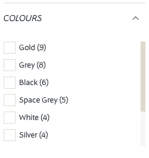
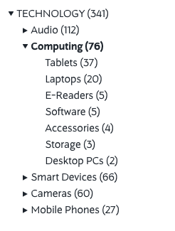
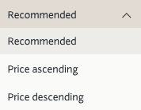

# Glossary

## A

### Autocomplete

Autocomplete is a part of the [Livesearch](#livesearch) which shows a list of words that begin with the term the user has typed.
For example, if a user types the letters `moist` in the search bar, the following autocompletions will appear:

* moist`ure`
* moist`urising`
* moist`uriser`

!!! Notice
    Autocomplete options always match available documents, there will never be an option that does not match a document.

## C

### Configurable Product

A configurable product is an item that requires the customer to choose one or more ‘options’ prior to purchase. For example, when buying shoes, the customers need to select what shoe size they want to buy. Many clothing items may well have both color and size choices that have to be made by the customer.
It is possible to specify different prices for some or all of the configurable options in a configurable product. As an example, some store owners might wish to price small, medium and large T-shirts at one price, with XL sizes and above priced slightly higher.[^products]

## D

### Document

A document represents a searchable entity within Searchperience. Each document has a type assigned to it e.g. brand, category, retailer, location, products or even crawled web pages.

#### Types

A type represents a subset of [documents](#document) that share common properties.

When searching for any document type the following configuration options are available:
 
* generate [facets](#facet) based on the available data
* expose [filters](#filter) to filter out data
* show [suggestions](#suggestion) to user input
* do a [second search](#second-search) in case there are no documents matching the user input
* provide [sorting](#sorting) options for the resulting documents

This configuration can be different for every endpoint. It is possible to search for only one type of an endpoint by providing the `type` parameter in the request.

## E

### Endpoint

An endpoint is a URL[^url] that one can visit to obtain [documents](#document). It is possible to use HTTP GET parameters to filter down results or apply [sorting](#sorting).
An endpoint can serve results in multiple formats, the response format depends on the provided [HTTP-Header](#http-accept-header).
The documents included in the response are normally split in subsets with common properties known as [types](#different-types). An endpoint can be configured to execute searches on a single or multiple [types](#different-types).

### Elasticsearch

Elasticsearch is a distributed, open source search and analytics engine for all types of data, including textual, numerical, geospatial, structured, and unstructured.

## F

### Facet

Facets behave in a similar way to a filter, however they also provide the available options for that property e.g. a `color` facet would also return the values `{blue, green, red, white, ... }`.

!!! Danger
    Facets are visible to users, so that they can easily filter down through documents based. One can think of facets as filters with a user interface.

!!! Notice
    Facet options shown are generated out of the available properties inside documents. This means that there will never be a Facet option that does not have at least one matching document.

There are different types of Facets that can be used:

* a [list](#list) facet
* a [tree](#tree) facet
* and a [range](#range) facet

#### List

A list Facet displays facet options in a flat list structure.
Usually in a list Facet multiple options can be selected (this behaviour is configurable).



#### Tree

A tree Facet displays facet options in a tree structure of a desired depth.
This Facet type is particularly useful for showing categories.
Usually in a tree Facet only a single option can be selected (this behaviour is configurable).



#### Range

A range Facet displays the minimum and maximum possible facet options from the available documents.
The range Facet allows you to select minimum and maximum value for a certain document feature.
This Facet is useful for showing e.g. a price or a quantity slider.


### Filter

Filters help to reduce the scope of the search by reducing the number of search results. This is done by requesting only documents that match a certain property e.g. `color` or `size`. A filter will only be applied if it has been configured; if a request with a non-configured filter is made, this will just be ignored.

Filters can be configured on an [endpoint](#endpoint) basis, i.e. one endpoint can have filters for `sizes` and `colors`, while another endpoint can have filters for `brands` and `retailers`.
When working with multiple [types](#different-types) on a single endpoint, it is possible to configure a filter so that it matches all available types on that endpoint.

### Frontend

This Searchperience application is responsible for delivering search results. Almost all traffic between Searchperience and the online shop would go through this application. [Endpoints](#endpoint), results type ([JSON](#json-response) or pre-rendered [HTML](#html-response)) are configured and managed here.

## G

### GTM

Google Tag Manager is a free tool that allows you manage and deploy marketing tags (snippets of code or tracking pixels) on your website (or mobile app) without having to modify the code.
See also [Google Marketing Platform](https://marketingplatform.google.com/about/tag-manager/)

## H

### HTML response

Using the HTML response format improves rendering speeds for search results and make the experience generally faster, however there are trade-offs as results can not be customized as with a [JSON response](#json-response).
An HTML response format is also more useful when dealing with older browsers or slower devices. The Searchperience [Frontend](#frontend) can be configured to render custom HTML markup, which can be directly injected into any web page.

### HTTP-Accept header

This HTTP-Header defines which Content-Types are acceptable for the requesting client. See also [content negotiation](https://en.wikipedia.org/wiki/Content_negotiation).

We do support the following formats:

* [Accept: text/html](#html-response)
* [Accept: application/json](#json-response) (default format)

## J

### JSON response

The JSON[^json] response can be integrated with various clients (apps, single page applications, etc.)
It renders pure JSON, which includes [facets](#facet), [pagination](#pagination) and [documents](#document).

## L

### Livesearch

A Livesearch endpoint is a special [endpoint](#endpoint) used to show users a preview of the search results before executing the search request.
A Livesearch request is faster than a normal search request and also offers special features like [redirecting on match](#redirect-on-match) or expanded navigation (when using the Searchperience [JavaScript library](#javascript-library)) which allows interaction using a keyboard or mouse. Results shown in the Livesearch can also be highlighted.

A Livesearch result typically consists of:
 
* an [autocomplete](#autocomplete) section
* a [suggestions](#suggestion) section
* and a section that contains a subset of documents (1 to 5) of some or all available [types](#different-types).

## M

### Mime Type

A Mime Type is a more technical and specific description for the type (like `product` or `brand`) of a [document](#document).
It allows us to identify the type of a document and tells us what data format we can expect.
Most of the documents are expected to be in the JSON[^json] format and are sent to us by external systems.
Some of them, like `text/html` (representing web pages) or `application/pdf` (representing PDF documents) are downloaded via the Searchperience Crawler.  

## N

### Node Hash

The Node Hash is a feature of Searchperience Frontend which ensures consistently ordered search results for a user.
It was needed because the underlying data store (Elasticsearch) distributes its data over multiple nodes and relevance
calculation is usually done on one node which could result in "jumping results" whenever a user refreshes the same page
multiple times.

To use it, one just has to append the `nodeHash` parameter when using Frontend. It can be an arbitrary string which should
be calculated based on the user.

On search result pages "jumping results" are less of an issue. The chance of documents having the same score
is not that high since the user provided a query which influences each documents score heavily. ("How good is a match with that query?")
On category pages that issue can occur much more often because there are only filters set and no query is provided.
A filter does not influence a documents score. That means Elasticsearch gives the same score to almost every returned document.  

You can get more information in the Elasticsearch documentation:

* [Getting consistent scoring](https://www.elastic.co/guide/en/elasticsearch/reference/7.x/consistent-scoring.html)
* [Preference](https://www.elastic.co/guide/en/elasticsearch/reference/6.8/search-request-preference.html) (the feature we utilize to achieve consistent scoring)

## P

### Pagination

In case of a large number of [documents](#document), pagination of the results is possible.
The maximum number of pages and the number of documents in a page is configurable.

## R

### Redirect on match

Redirect on match is a feature primarily used in [Livesearch](#livesearch) [endpoints](#endpoint).
When a user searches for something an [HTTP-Header](#http-accept-header) is returned along with the results indicating that there was an exact match for the provided query.
The Searchperience [JavaScript library](#javascript-library) uses this [HTTP-Header](#http-accept-header) to redirect to a dedicated page in case the user executes the search request.

*Possible use case:*

* A user want to search for a brand name
* If the user enters the name `nike` as text in the search input field and gets [Livesearch](#livesearch) options based on it
* The term `nike` is the exact name of a brand that belongs to your products so the [HTTP-Header](#http-accept-header) indicating this is a valid redirect target
* When the user executes the search we can redirect him to a dedicated `Nike` catalogue page with a pre-defined filter on the brand `nike`.

*Example [HTTP-Header](#http-accept-header) attached to the [Livesearch](#livesearch) response:*

```text
SP-Redirect:https://www.yourdomain.com/products/brand/nike/
```

### Relevance

The more relevant a product is the higher it will appear in search results. We use the BM25 algorithm to match between the [search query](#search-query) and a document.

## S

### Search query

The input of the user in the search field. In other words, the term or terms the user is searching for. 

### Second Search

The Second Search is a core feature and happens transparently in the background. It is commonly used for giving results whenever a search term would yield no results but a similar word would (Spelling Correction).

A Second Search is triggered when:

* No types have results (if one type has results we never fire the Second Search)
* Suggestions are configured and give back a suggestion for the search term

### Simple Product

A simple product is a physical product that is shipped to a customer. A simple product might be, for example, a lamp, or a vacuum cleaner. It has no options attached to it such as size, color or material.
Each simple product will have its own unique SKU.[^products]

### Sorting

A Sorting can be used to sort the [documents](#document) in the search result.
The available options are configurable.

{ .align-left .vertical-top }
{ .align-right }

### Stopword

Stopwords[^stopword] are a set of terms that the search engine should ignore while querying. The main goal of this feature is to lead to more precise search results and increase the performance of every request (depends on the amount of [documents](#document) available).

For each individual language a standard set of stopwords is preconfigured, check the [lucene repository](https://github.com/apache/lucene-solr/tree/master/lucene/analysis/common/src/resources/org/apache/lucene/analysis/snowball) for a detailed overview. However, if you are missing some words within the default list you can use the [custom stopwords module](cockpit/stopwords.md) within the Searchperience Cockpit.

### Suggestion

[Suggestions](concept/suggestions.md) are a part of the [Livesearch](#livesearch) that show a list of words that are similar to the term the user typed.
This is a great usability feature as it helps users to recognise and correct mistyped words.
For example, if a user typed `berformance` the corresponding suggestion would be `performance`.

!!! Notice
    Suggestions are generated out of the available [documents](#document), so there will never be an option that does not match a document.

### Synonym

Synonyms[^synonym] allow to configure relationships between terms, so that when a user searches for a term, it would be like searching for a similar one. This improves search quality and lead users to better results. One common example would be to create a synonym for the term `notebook` which also shows results for `MacBook`. Another case could be to handle abbreviations like `TV` to be equal to `television`. Nevertheless, synonyms are a very specialized instrument, which heavily depends on the data provided to Searchperience.

!!! note ""
    In general synonyms are always customer specific, that means that we do not provide any defaults in order to avoid side effects.

## T

### TopKeyword

A topkeyword contains a `searchQuery` and information about the context in which the query lead to a purchase. This is the reason why information as `brandCode` or `retailerCode` are also present.

The `/popularSearches` Frontend endpoint returns a collection of TopKeywords objects. Each Topkeyword consists of various elements as can be seen in the next code snippet.

```json
{
    "foreignId": "a114e69a5746e2cfa326f7c8df21ec1a",    // hash of the fields' contents except occurrences 
    "searchQuery": "henne",                             // user input in search field
    "brandCode": "hennessy",
    "retailerCode": "world-duty-free",
    "categoryCodes": [
        "food_drink",
        "food_drink_wine_spirits",
        "food_drink_wine_spirits_cognac"
    ],
    "channel": "master",
    "locale": "en_GB",
    "referer": "-",
    "occurrences": 1
}
```

## U

### User Profile

!!! info
    Only available when the Searchperience Tracker is integrated into the online shop.

Searchperience will generate a [document](#document) for every logged in user in the shop. Inside it one can find the brands, categories and retailers which the user has interacted with. These entities contain preference values that indicate how relevant is a certain entity to the corresponding user.

The values are computed by analysing the number of click, view, addToCart and checkout events a user generates around the shop with different products in the past 365 days. All these interactions are grouped and added up and a user profile document is generated for the corresponding user. These profiles are computed once a day for the events from the day before.

The default values for these interactions are the following

```text
"click" = 1.0
"view" = 5.0
"addToCart" = 10.0
"purchase" = 25.0
```

A user profile document looks like this

```json
{
    "foreignId": "2719f3e2-e6c7-496b-bf75-f5bdf8a509c0-en_GB-master",
    "userId": "2719f3e2-e6c7-496b-bf75-f5bdf8a509c0",
    "channel": "master",
    "locale": "en_GB",
    "preferences": {
        "brand": [
            {
                "brandCode": "cath-kidston",
                "preferenceValue": 250.0
            },
            {
                "brandCode": "blackberry",
                "preferenceValue": 25.0
            }
        ],
        "category": [
            {
                "categoryCodes": [
                    "women_accessories"
                ],
                "preferenceValue": 250.0
            },
            {
                "categoryCodes": [
                    "technology_smartphones"
                ],
                "preferenceValue": 25.0
            },
            {
                "categoryCodes": [
                    "beauty_fragrance_women"
                ],
                "preferenceValue": 20.0
            }
        ],
        "retailer": [
            {
                "retailerCode": "cath-kidston",
                "preferenceValue": 250.0
            }
        ]
    }
}
```

## W

### Widget

With Widgets it is possible to obtain a group of [documents](#document) from Searchperience. This flexible content can be used on the website to promote e.g. products.

[^url]: [Uniform Resource Locator (URL)](https://en.wikipedia.org/wiki/URL)
[^json]: [JavaScript Object Notation (JSON)](https://en.wikipedia.org/wiki/JSON)
[^rangeMinMax]: For example, a user clicked on a brand facet, thus filtering the result to return less documents and potentially making the price range smaller.
[^stopword]: More information about [stopwords on Wikipedia](https://en.wikipedia.org/wiki/Stop_words)
[^synonym]: More information about [synonyms on Wikipedia](https://en.wikipedia.org/wiki/Synonym)
[^products]: More information about [Understanding Simple Products versus Configurable Products in Magento](https://paulnrogers.com/understanding-simple-products-versus-configurable-products-magento)