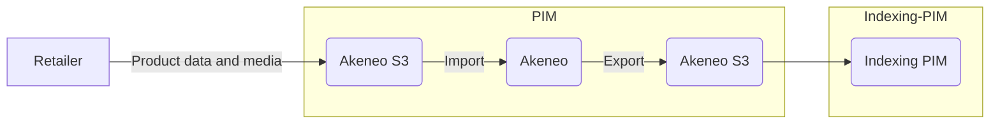
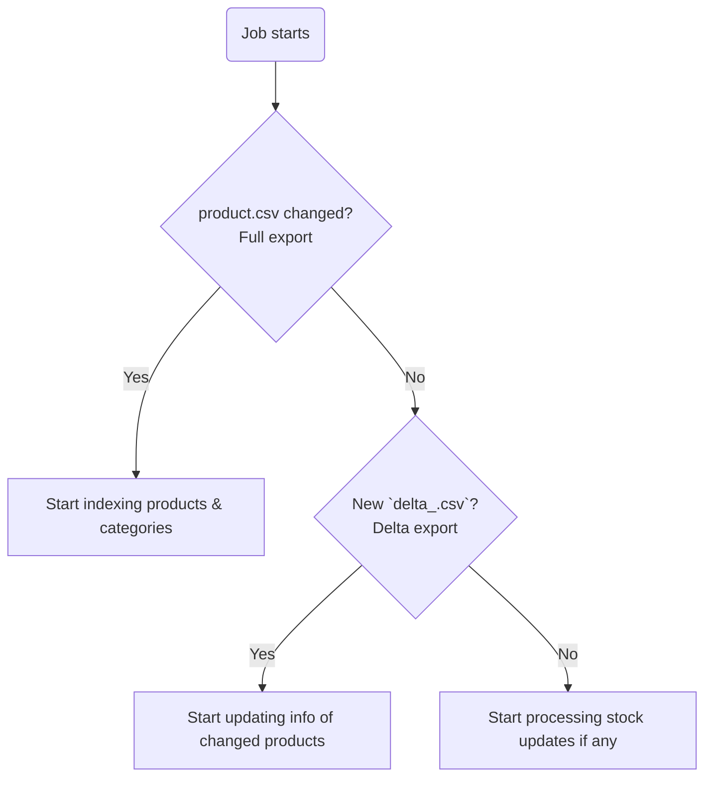

In OM3 *product* and *category* data comes from Akeneo PIM.

## Flow



## Akeneo product exports

Akeneo PIM exports data as CSV in the Akeneo bucket. Exports can be found under `akeneo-s3/tenant/export/`

### Delta

!!! tip 
    Delta exports do not pick up changes to attributes or categories. Just product information.

| Frequency    | Description                                                             |
|--------------|-------------------------------------------------------------------------|
| Every 15 min | This export only includes products added / modified in the last 15 min. |

The result of this export includes a `delta_<timestamp>.csv` file.

### Full

!!! tip 
    As it names states, full exports include the entire data in Akeneo. Attributes, Categories and so on will only update in Searchperience after this export takes place.

| Frequency     | Description                                         |
|---------------|-----------------------------------------------------|
| Every 2 hours | This export includes all information in Akeneo PIM. |

The result of this export includes a `product.csv` file among other files which contain categories, attributes, etc.

## Indexing PIM

An integration application, which is responsible to read the CSV export from Akeneo PIM and convert product and categories information in the Searchperience format.

Indexing PIM does multiple transformations / enrichments to the Akeneo PIM data, some include:
    
- Each product is pushed for every channel, every language and every currency to Searchperience.
- Configurable products are aggregated and pushed as a single document to Searchperience.

Indexing PIM does multiple validations to the Akeneo PIM data, which includes:
    
- Products must be assigned to a category which is a child of the main channel.
- Products must have a brand which is also available in MasterDataPortal. Most importantly, the brand code in Akeneo PIM and MasterDataPortal have to match _exactly_.
    - Also, if MasterDataPortal is not reachable (i.e. network error) while indexing a product, the validation will fail and this product will not be imported. 
- Configurable products must at least have one variant. 
- Categories have to be assigned as children of the main channel.
- All attributes have to be assigned to a product family.
- Simple products should have stock information or the attribute `alwaysInStock` must be `true`.
    
!!! danger 
    If one of the validation fails the product will not be transformed and therefore not relayed to Searchperience.

Indexing PIM is actively listening for changes in stock. 

Stock update message body example:
```json
{
  "data": [
    {
      "quantity": 12,
      "sku": "168277",
      "sourceCode": "onairport-t2-landside-aoe-2",
      "sourceRetailerCode": "3sixty"
    }
  ]
}
``` 

In case of a stock update, it will automatically reindex the product. 

### Jobs

Every 2 minutes Indexing PIM will trigger a new job. The jobs follow this logic:



### Trigger an indexing manually 
In case there is no change in the product information and you want to trigger a new export because: 

- MasterDataPortal was not reachable when indexing the `product.csv`
- You want to update stock information on all products

Go to the sp-api-documentation, choose Indexing PIM (picker upper right) and trigger
 
- `/api/transfer/products` for products
- `/api/transfer/categories` for categories

Compared to the [jobs](#jobs) that are executed regularly, the ETag (file identifier) is ignored and a full export is started immediately.

As an alternative you can trigger the endpoint `/api/reset`. 
This will delete the ETag information of the CSV files and the next [job](#jobs) will trigger as a full export.