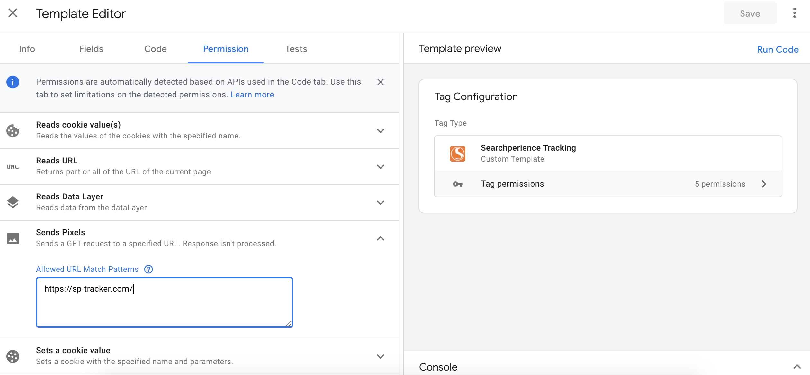
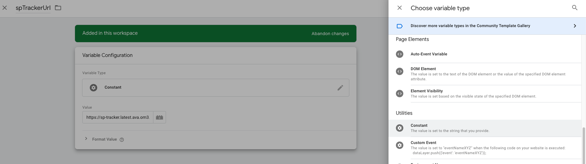
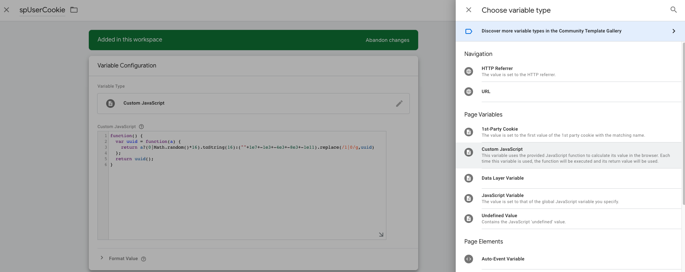
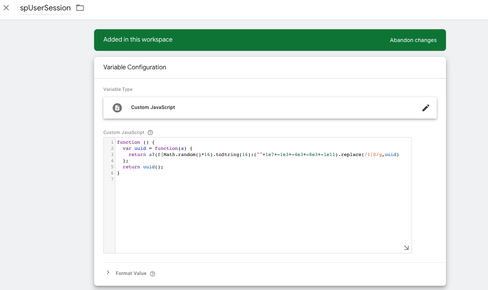
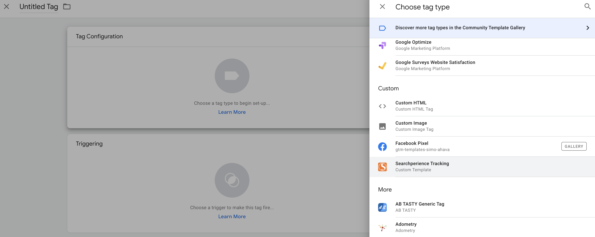
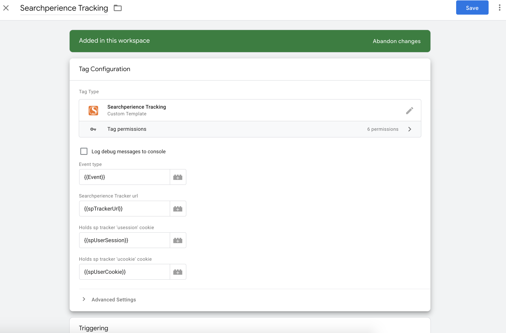
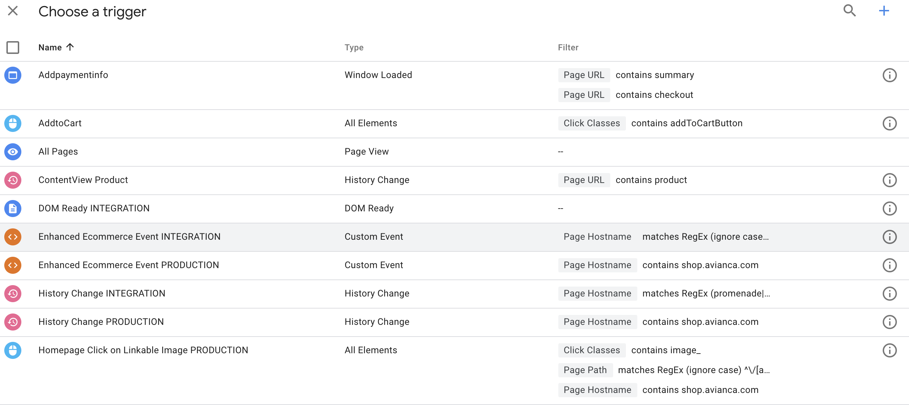

To be able to integrate Searchperience Tracker with [Enhanced Ecommerce](https://developers.google.com/tag-manager/enhanced-ecommerce) events of Google Tag Manager ([GTM](../../glossary.md#gtm)) we need to do some manual steps:
 
-  [Include the Searchperience Tracking Tag](#include-searchperience-tracking-tag)
-  [Add User-Defined Variables](#add-user-defined-variables)
-  [Configure Searchperience Tag](#configure-searchperience-tag)
 
### Include Searchperience Tracking Tag

Include the tag from the `Template Gallery`. For instructions please check [the Google documentation](https://support.google.com/tagmanager/answer/9454109?hl=en).

Navigate to the 'Permission' tab and fill 

* 'Accesses Local Storage' with the key `spUser` with read and write permissions.
* 'Reads cookie value(s)' for specific cookies i.e. `spSession` and `spUser`.
* 'Reads URL' to Any
* 'Reads Data Layer' with keys `event`, `ecommerce.*`, `userId`.
* 'Sends Pixels' with the Searchperience Tracker URL.
* 'Sets a cookie value' for the cookies `spSession` and `spUser` with wildcard `*` Domain and Path and `Any` Value for Session and Secure.



Binding from GTM to SP Tracker events

| GTM Event Type            | SP Tracker Event Name | Description GTM Enhanced Ecommerce                                                                                                                                         |
|:--------------------------|:----------------------|:---------------------------------------------------------------------------------------------------------------------------------------------------------------------------|
| `productClick`            | `click`               | [Measuring Product Clicks](https://developers.google.com/tag-manager/enhanced-ecommerce#product-clicks)                                                     |
| `productDetailImpression` | `view`                | [Measuring Views of Product Details](https://developers.google.com/tag-manager/enhanced-ecommerce#details)                                                  |
| `addToCart`               | `addToCart`           | [Measuring Additions or Removals from a Shopping Cart](https://developers.google.com/tag-manager/enhanced-ecommerce#cart)                                   |
| `purchase`                | `purchase`            | [Measuring Purchases](https://developers.google.com/tag-manager/enhanced-ecommerce#purchases)                                                               |
| `productImpression`       | `search`              | Used in combination with search query and [Measuring Product Impressions](https://developers.google.com/tag-manager/enhanced-ecommerce#product-impressions) | 

The template is also available in [GitHub](https://github.com/AOEpeople/searchperience-google-tag-template).

### Add User-Defined Variables

The custom tag template "Searchperience Tracking" requires some user-defined variables in order to track events.

Go to Variables tab in Google tag manager and click "New" under User-Defined Variables. More info about [User-defined variable types](https://support.google.com/tagmanager/answer/7683362?hl=en)

Create variables described below:

#### SP Tracker URL

| Variable Name  | Type     | Description                          |
|:---------------|:---------|:-------------------------------------|
| `spTrackerUrl` | Constant | Used to configure the SP Tracker URL |

Value:
e.g. `https://search-tracker.krisshop.com/`



#### SP User Cookie

| Variable Name  | Type              | Description                                                                  |
|:---------------|:------------------|:-----------------------------------------------------------------------------|
| `spUserCookie` | Custom JavaScript | Used to configure a user cookie. Custom JavaScript code that returns a UUID. |

Value: 
```javascript
function() {
  var uuid = function(a) {
    return a?(0|Math.random()*16).toString(16):(""+1e7+-1e3+-4e3+-8e3+-1e11).replace(/1|0/g,uuid)
  };
  return uuid();
}
```


#### SP User Session

| Variable Name   | Type              | Description                                                                   |
|:----------------|:------------------|:------------------------------------------------------------------------------|
| `spUserSession` | Custom JavaScript | Used to configure a user session. Custom JavaScript code that returns a UUID. |

Value: 
```javascript
function() {
  var uuid = function(a) {
    return a?(0|Math.random()*16).toString(16):(""+1e7+-1e3+-4e3+-8e3+-1e11).replace(/1|0/g,uuid)
  };
  return uuid();
}
```


!!! Notice
    `spUserCookie` and `spUserSession` return unique values during event triggering.
    Variable type is 'Custom Javascript', the reason for that: [Tag Template Sandboxed JavaScript API](https://developers.google.com/tag-manager/templates/api) is very limited, 
    for instance to generate a UUID we need Math.random() which is not available in the sandbox.

### Configure Searchperience Tracking Tag

At this step we need to create a new tag in GTM workspace and [configure](#tag-configuration) it to use our imported custom tag template.

[Assign variables](#assign-variables) to be able to use values in the template.

Add [Trigger](#triggering) to make our tag firing.

#### Tag Configuration

In GTM workspace go to 'Tag' section and click 'New' button.

Click on 'Tag Configuration' area to choose a tag type. More about [tag types](https://support.google.com/tagmanager/answer/3281060?hl=en).

Scroll the list to the 'Custom' section and choose 'Searchperience Tracking' custom template ([Create a Custom Tag Template](#create-a-custom-tag-template)).
Name it properly like 'Searchperience Tracking'.



#### Assign variables 

Clicking on 'Plus' button right to the input field (the built-in and user-defined variables list will appear) and select their corresponding variables that we created.



!!! Notice
    `Event type` must be a built-in variable `Event` - contains event name, we use it in our custom tag template tracking logic to map to [sp-tracker events](#events).  

#### Triggering

Choose a trigger to make a tag fire. More about [triggers](https://support.google.com/tagmanager/topic/7679384?visit_id=637203139206366923-620922882&rd=1).

We should use an existing trigger depending on the environment: '`Enhanced Ecommerce Event INTEGRATION`' (for testing) or '`Enhanced Ecommerce Event PRODUCTION`'.



!!! Notice
    '`Enhanced Ecommerce Event <environment>`' it's 'Custom Event' type trigger configured to track all eCommerce events.   

Save it and go back to main screen.

### Testing changes

Before submit changes by clicking 'Preview' mode you can preview and debug workspace by opening your site in a new browser tab. 
More about [preview and debug containers](https://support.google.com/tagmanager/answer/6107056?hl=en).

### Apply changes

Simply click on 'Submit' button in GTM workspace.
